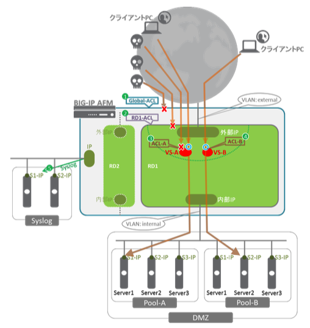

## AFM動作概要

AFMの基本動作イメージを以下に示します。

1. BIG-IPへパケットが入力されると、まずはGlobalのACL (図中：Global-ACL) で評価されます。
2. Globalを通過すると、次はRoute DomainのACL (図中：RD1-ACL) で評価されます。
3. Route Domainを通過すると、次はVirtual ServerのACLで評価されます。VS-Aに割当てられたACL (図中：ACL-A) にて評価され、許可されたパケットがVS-Aに到達します。
4. VS-Bも同様にACL (図中：ACL-B) で評価され、許可されたパケットのみがVS-Bに到達します。
5. ACLで許可／拒否されたログはハイスピードロギング機能により、Syslogサーバへ出力されます。

さらにセキュリティを強化するための、以下のような機能も確認します。

- Layer 2~4のDoSからの防御機能
- HTTPレベルのプロトコル違反がないかをチェックする機能 (Protocol Security)
