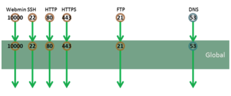

# Globalのポリシー

(1) ACL

本ガイドでは、BIG-IP筐体全体のポリシーとして、今回利用するポートだけを通過させることとします。

このGlobal設定は全ルートドメイン＆全バーチャルサーバに影響します。

本ガイドで利用する全ポートは以下です。

1. HTTP： 80/tcp

2. HTTPS: 443/tcp

3. FTP： 21/tcp

4. SSH： 22/tcp

5. Webmin： 10000/tcp

6. DNS： 53/udp

(2) ログ

このGlobalポリシーを通過する際にログを出力する設定を行うと、バーチャルサーバで取得するログと重複するので、ここでは、これらのポート以外に来た通信＝拒否した通信に対してのみ、ログ出力を行う設定とします。
