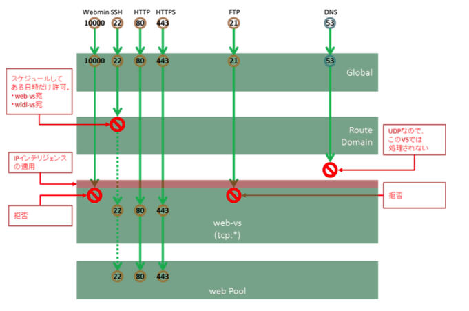

# web-vsのポリシー

HTTP(80)とHTTPS(443)両方のWebサービスを行うバーチャルサーバ、という位置づけです。

このVSではSSL終端は行わず、プールメンバーにてSSL処理を行う、という要件であると仮定します。

(1) ACL 

このバーチャルサーバでは、HTTP(80)とHTTPS(443)の2つのポートのみを受け付けるACL設定とします。

SSH(22)は通常時は拒否する設定ですが、Route Domainである日時にSSH(22)がAccept設定になると、VSの設定をスルーしてSSHアクセスが可能になる、という設定をRoute Domain側で実施します。

また、このバーチャルサーバでは、IPインテリジェンスによる不正な送信元IPのブロックを行います。

(2) ログ

このVSでは、通過したトラフィック及び拒否したトラフィック共にログ出力することとします。
