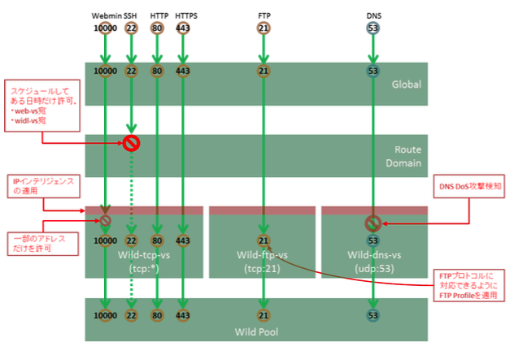

# wild-xxx-vsのポリシー

wild-xxx-vsでは様々なサービスを提供します。

プロトコルの特性に合わせ、バーチャルサーバを3つに分けます。

1. wild-dns-vs： DNSサービス用

2. wild-ftp-vs： FTPサービス用

3. wild-tcp-vs： その他のTCPサービスおよび管理用

(1) ACL

1. wild-dns-vs

- 本バーチャルサーバでは53/udp以外のプロトコルは拒否されるため、パケットフィルタを目的としたACLは設定しませんが、ログ出力を目的としたACL設定を行います。

- また、DNSに対するDoS攻撃を想定して、DoS攻撃検知のプロファイルを適用します。

2. wild-ftp-vs

- 本バーチャルサーバではFTP以外のプロトコルは拒否されるため、パケットフィルタ用のACLは設定しませんが、ログ出力を目的としたACL設定を行います。

- FTP通信の場合においては、FTPデータ通信用のTCPポート番号がTCP層(L4層)より上のプロトコルで決定されるため、本VSでは、FTP Profileを適用することで対応します。

3. wild-tcp-vs

- サーバ管理用として利用するwebmin(10000)を、ある特定のIPアドレス(10.99.4.1x)からのみ許可するACL設定とします。外部からwebminアクセスを行いたい管理者が存在する、という想定です。

SSH(22)に関しては、web-vsと同様、Route Domainにて、ある一定の日時のみ許可する設定とします。

このバーチャルサーバ群においても、web-vs同様、IPインテリジェンスを適用します。

(2) ログ

既述の通り、wild-dns-vsおよびwild-ftp-vsは通過したログのみをログを取得し、wild-tcp-vsでは通過したトラフィック及び拒否したトラフィック共にログ出力することとします。
