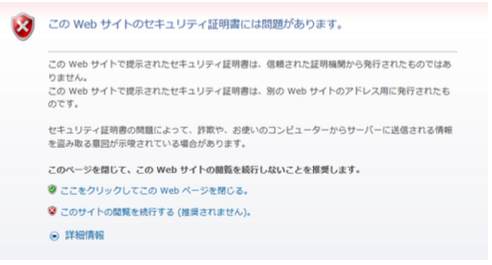
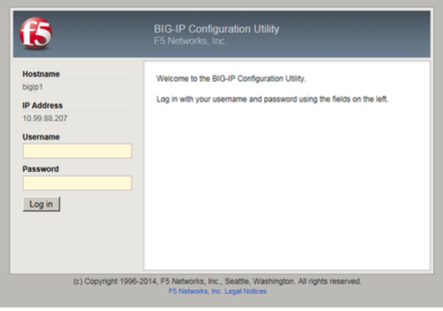
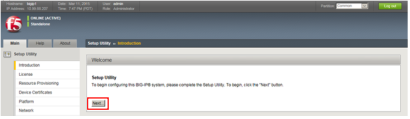
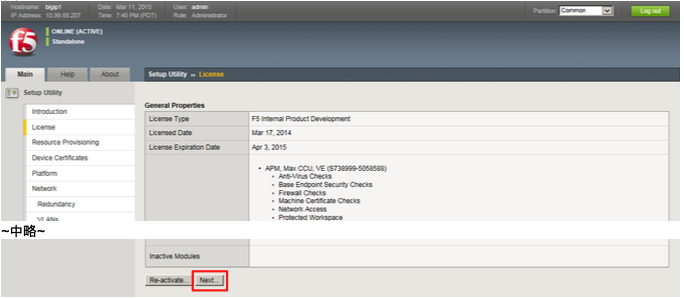
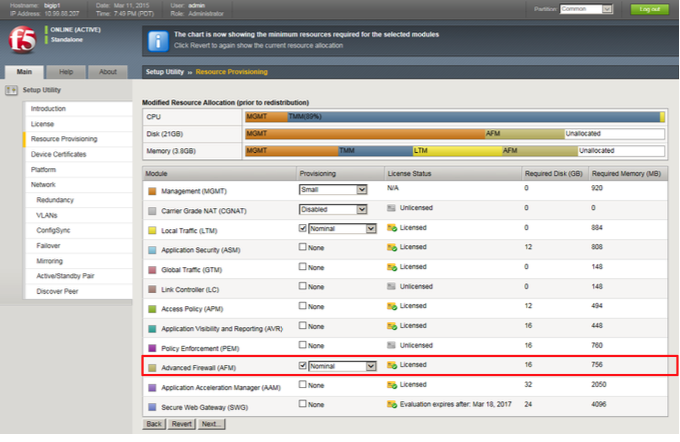
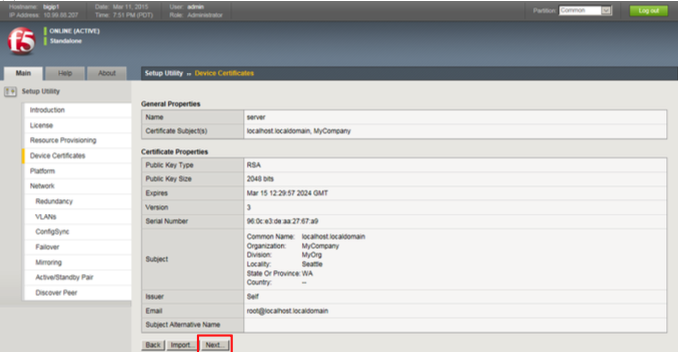
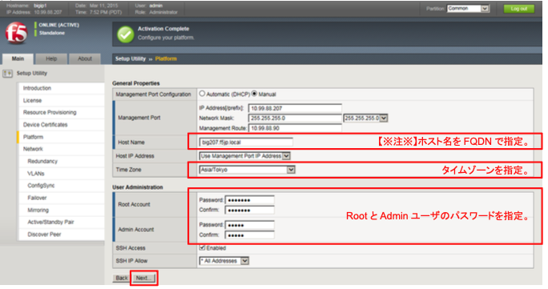
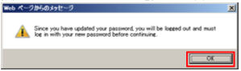
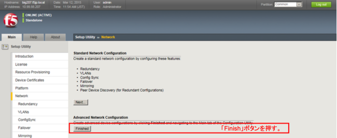

# 基本設定

## 管理ポートへのGUIアクセス
管理用PCから、設定したBIG-IPの管理IPアドレスへ、HTTPSでアクセスします。

【※注※】https://10.99.88.XXX

デフォルトの証明書は、正式に取得した証明書ではないため、以下のような画面が現れますが、「続行する」を選択してください。


(1) ログイン画面が現れますので、以下のデフォルトのIDとPasswordでログインしてください。
- ID：admin
- Password：admin



 (2) 「Next」ボタンを押します。


(3) ライセンス画面が出ます。「Next」ボタンを押します。


(4) プロビジョニング画面がでますので、「AFM」にチェックを入れます。


(5) SSL証明書の確認がなされますが、デフォルトのまま、「Next」ボタンを押します。


(6) ホスト名、タイムゾーン、Root/Adminそれぞれのパスワードを設定します。「Next」ボタンを押します。


設定したパスワードでログインを試みるよう、ログアウト→ログインするように指示があります。「OK」ボタンを押します。




(7) Username ＝ Adminと、設定したパスワードで再度ログインします。


(8) この後、Standard Network Configurationの「Next」を押すことでウィザード形式にて冗長化も含めた設定が可能ですが、ここではスタンドアローン構成にするため、Advanced Network Configurationの「Finished」ボタンを押します。


```{toctree}
:maxdepth: 1
:glob:
module01/**
```
