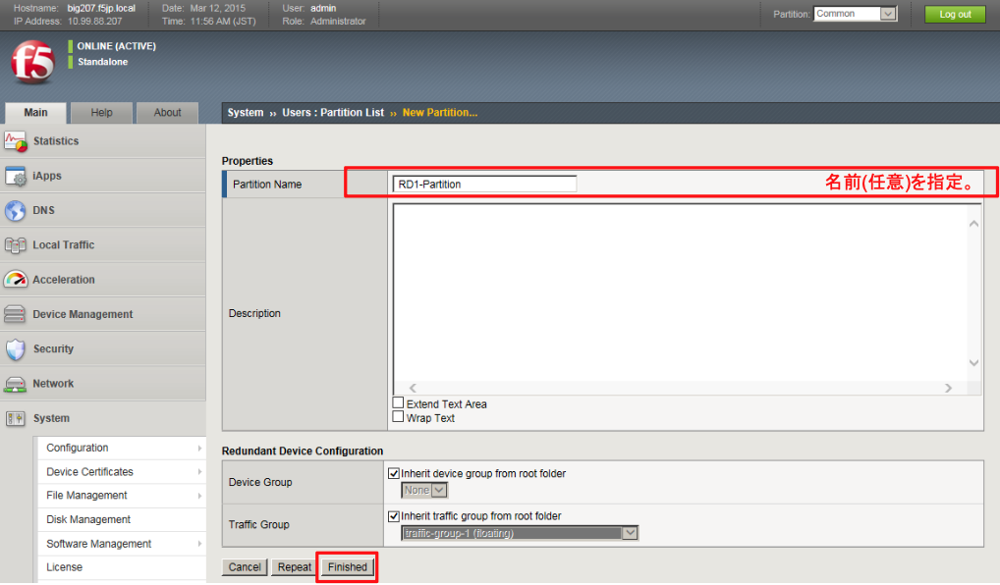
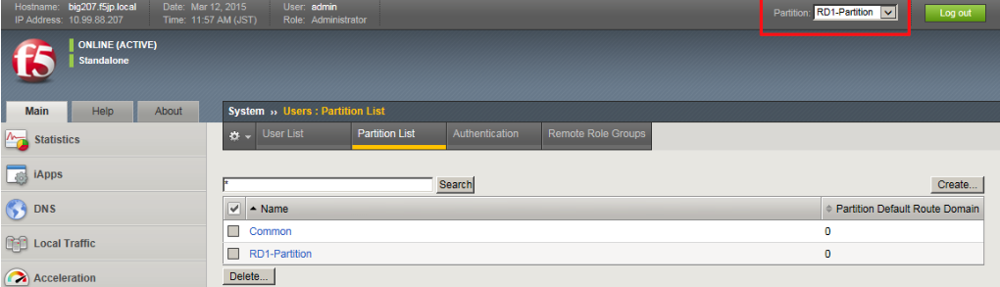

# 管理パーティションの作成

まず、ルートドメインを管理するための管理パーティションを作成します。

(1) RD1-Partitionの作成

「System」→「Users」→「Partition List」で表示された画面右上の「Create」ボタンを押し、現れた画面で以下のように設定します。


(2) RD1-Partitionへの切り替え

作成したパーティション：RD1-Partitionに切り替えます。


```{toctree}
:maxdepth: 1
:glob:
module01/**
```
