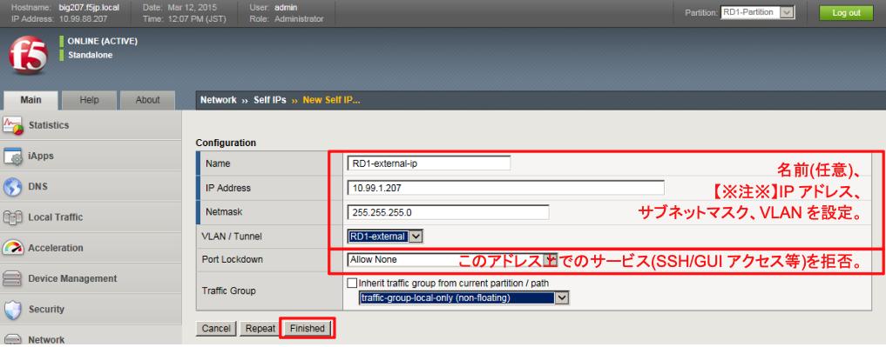
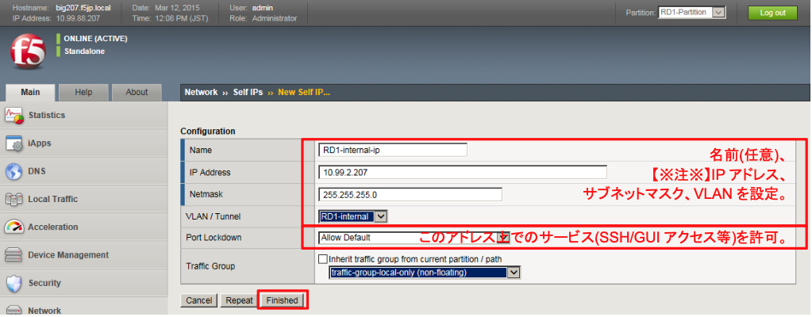

# Self IPの設定

設定したVLANそれぞれに対して、IPアドレスを設定していきます。

BIG-IP自身に設定するIPアドレスを、Self IPと呼びます。

「Network」 → 「Self IPs」で表示された画面の右上にある「Create」ボタンを押し、現れた画面で以下のように設定します。

(1) RD1-external VLANのIP設定

(2) RD1-internal VLANのIP設定
