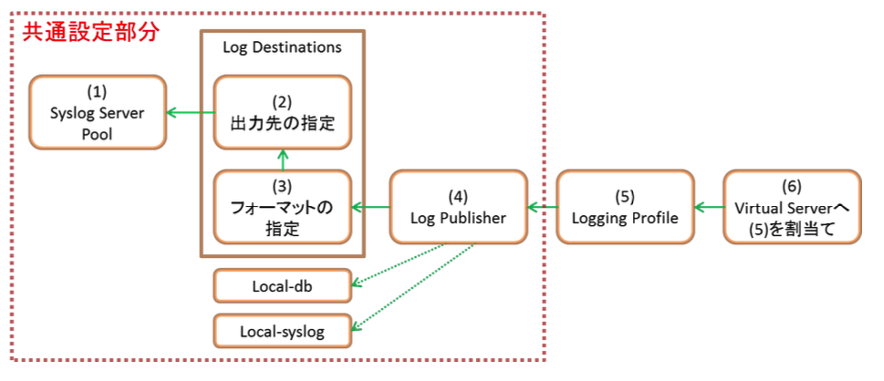
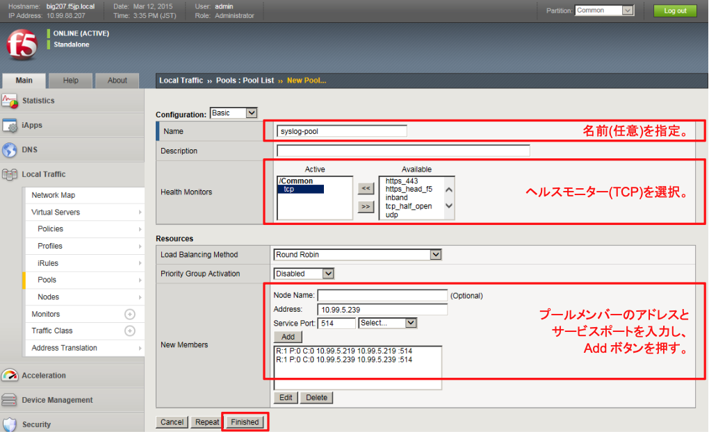
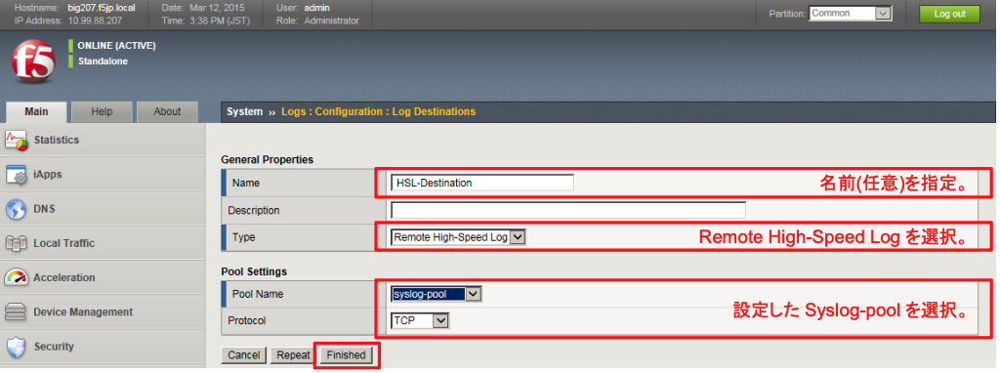
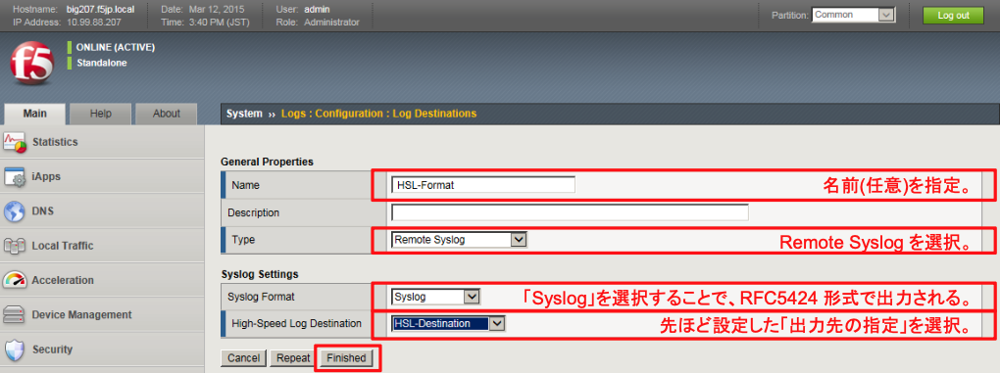
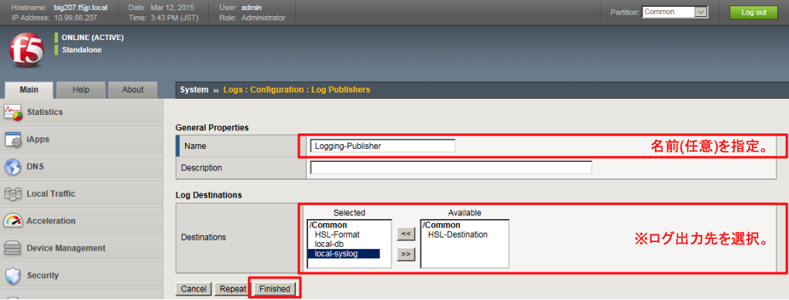

# ログ出力の設定

ログ出力を行うには、以下の6つのオブジェクトが関連します。

ここではまず、共通設定となる部分の(1)～(4)を設定します。

(1) Syslog Server Poolの設定

 Syslogを出力するサーバプールを作ります。

「Local Traffic」→「Pools」で表示された画面右上の「Create」ボタンを押し、現れた画面で以下のように設定します。

(2) 出力先の指定

作成したsyslog-poolをログの出力先とするための指定を行います。

「System」→「Logs」→「Configuration」→「Log Destinations」で表示された画面右上の「Create」ボタンを押し、現れた画面で以下のように設定します。

(3) フォーマットの指定

どのようなフォーマットでログを出力するかの指定を行います。

再度、「Create」ボタンを押し、現れた画面で以下のように設定します。

(4) Log Publisherの設定 

Log Publisherで、どこにログを出力するかを複数選択することができます。

「System」→「Logs」→「Configuration」→「Log Publishers」で表示された画面右上の「Create」ボタンを押し、現れた画面で以下のように設定します。

※ 本ガイドではログの出力先として、HSL以外にもLocal-dbおよびlocal-syslogを選択しています。

しかし、BIG-IP内部へのログ出力はCPU使用率の上昇につながるため、パフォーマンスを重視する場合には、 HSLによる外部出力のみ設定(上記例では"HSL-Format"だけ設定)することを推奨します。
