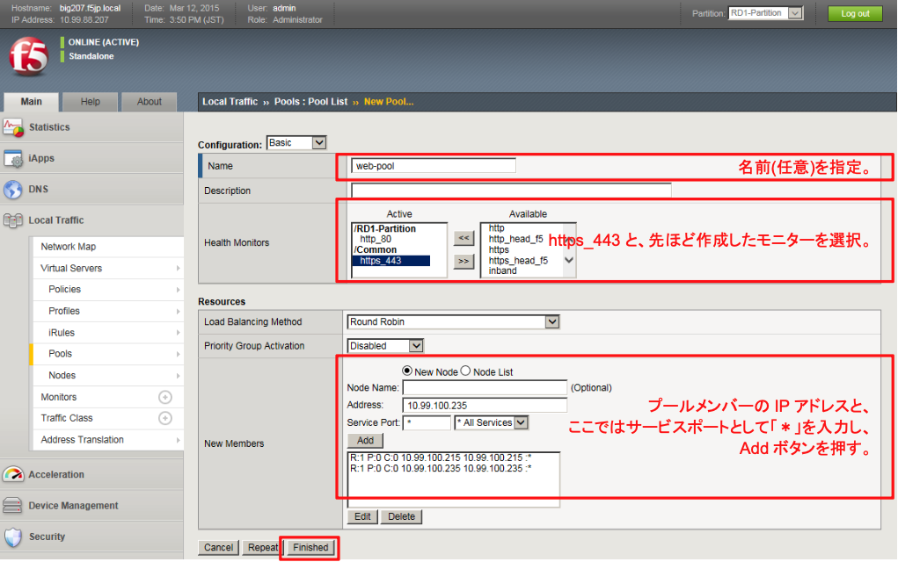
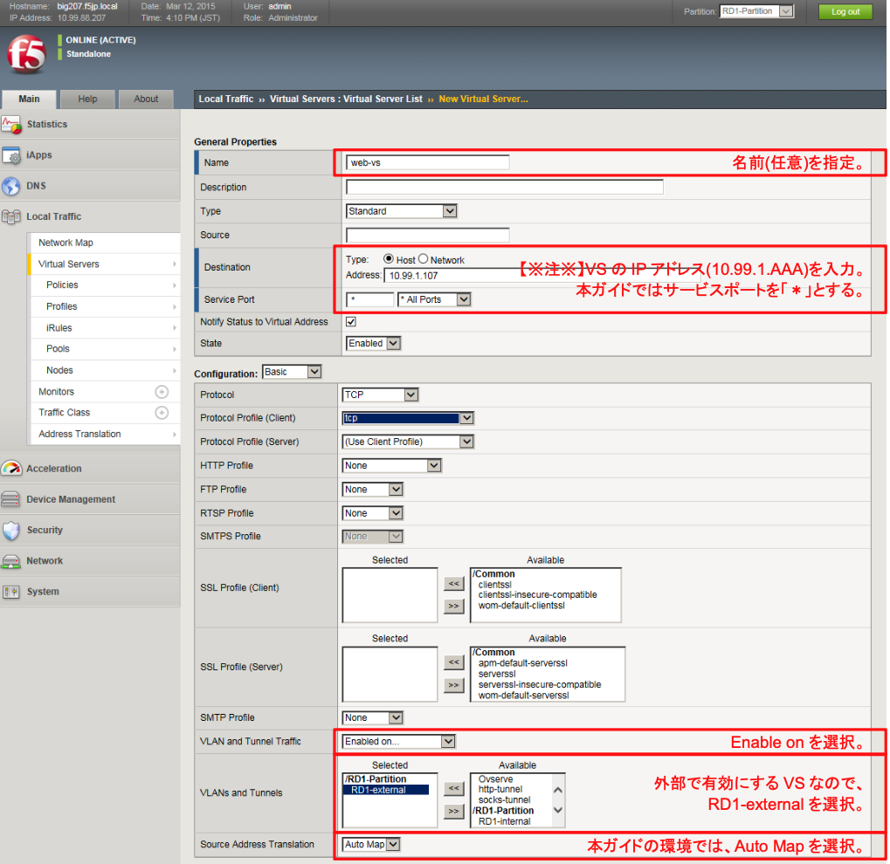

# web-vs設定

## HTTP(80)のMonitor設定

本ガイドのweb-poolでは、HTTP(80)，HTTPS(443)，そしてSSH(22)が動作しているので、Pool設定の際に、サービスポートをワイルドカード "＊" で指定します。

そのため、ヘルスモニターを行うポートは別途明示的に指定しておく必要があります。

HTTPS(443)はデフォルトで用意されていますが、HTTP(80)は存在していないので、先に作っておきます。

「Local Traffic」→「Monitors」で表示された画面右上の「Create」ボタンを押し、現れた画面で以下のように設定します。

## Pool設定
「Local Traffic」→「Pools」で表示された画面右上の「Create」ボタンを押し、現れた画面で以下のように設定します。

## Virtual Server設定
「Local Traffic」→「Virtual Servers」で表示された画面右上の「Create」ボタンを押し、現れた画面で以下のように設定します。

～略～
