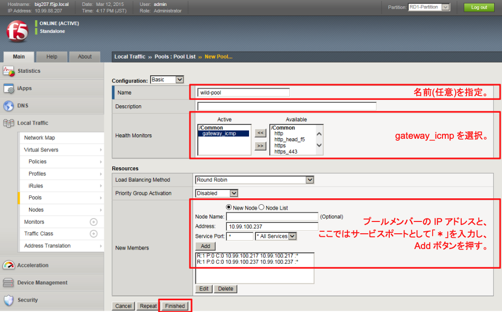
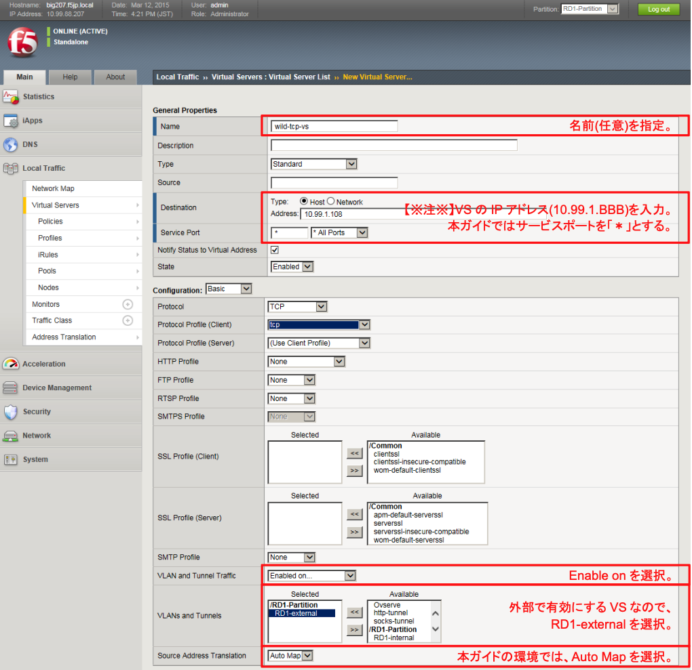
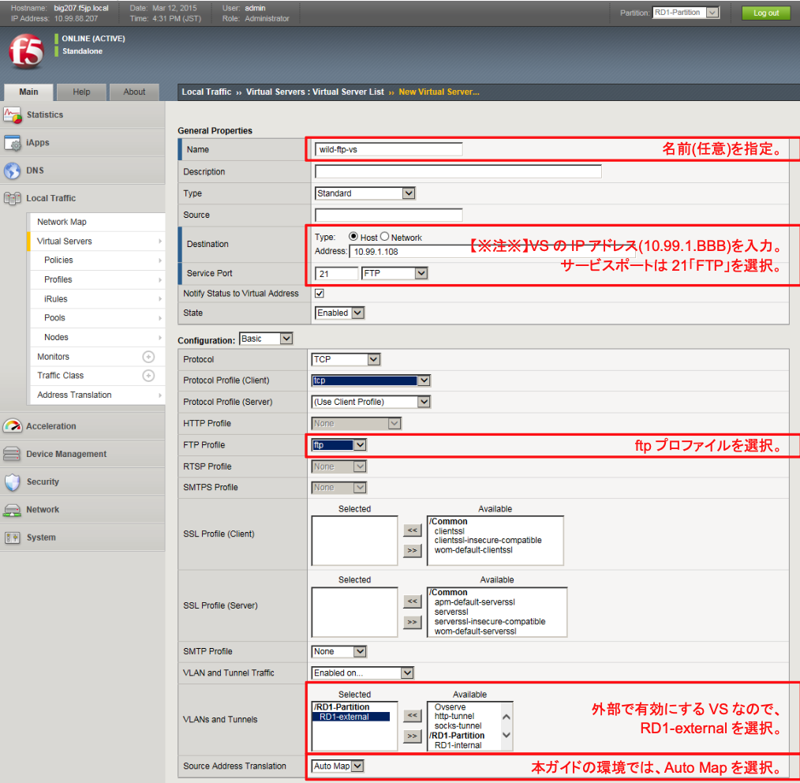
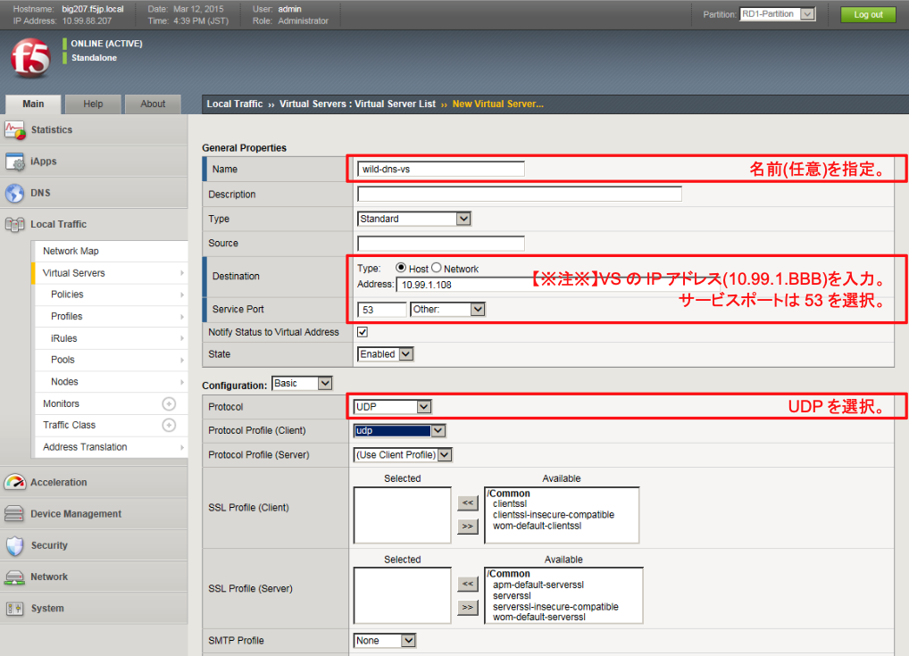
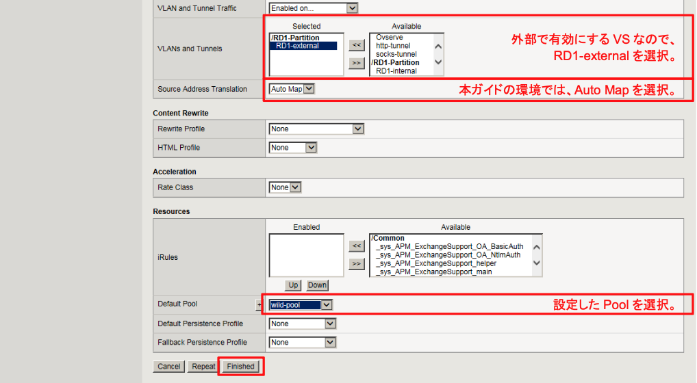

# wild-xxx-vsの設定

## wild-poolの設定
本poolでは多数のサービスが動いており、個々の全サービスに一つずつヘルスモニターを設定してもよいのですが、本ガイドでは簡易的にICMPによるヘルスモニターとします。

「Local Traffic」→「Pools」で表示された画面右上の「Create」ボタンを押し、現れた画面で以下のように設定します。

## wild-tcp-vsの設定
「Local Traffic」→「Virtual Servers」で表示された画面右上の「Create」ボタンを押し、現れた画面で以下のように設定します。

～略～

## wild-ftp-vsの設定
同様の方法で、ftp用VSを設定します。

～略～

## wild-dns-vsの設定
同様の方法で、DNS用VSを設定します。

