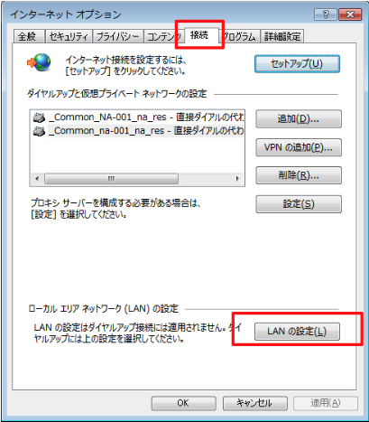
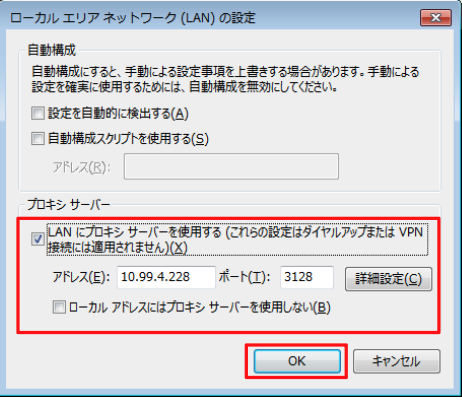
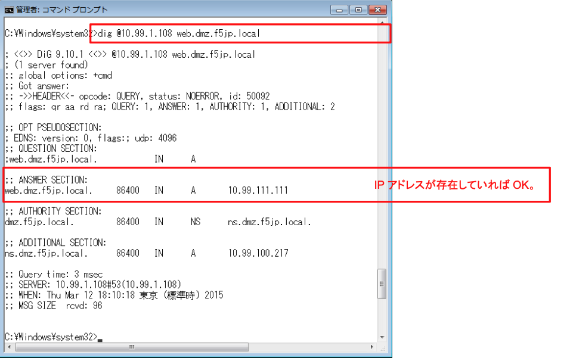
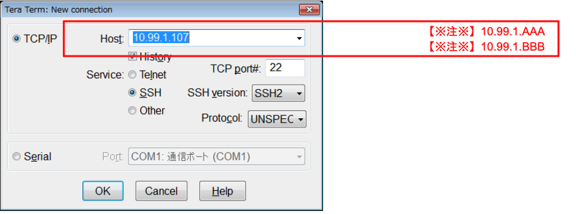
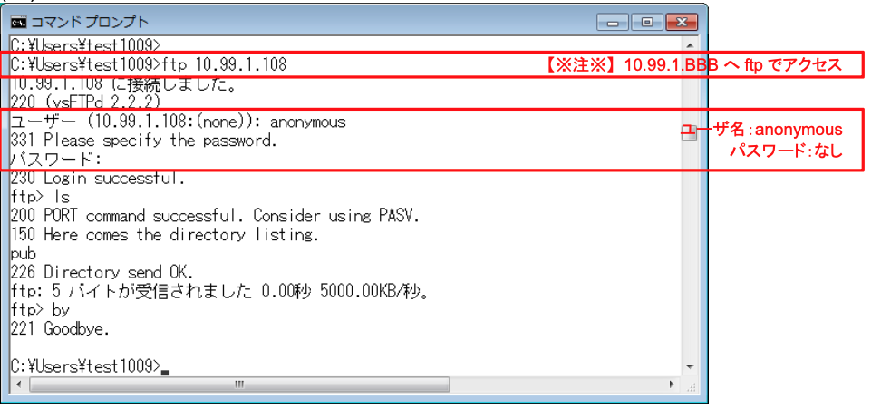

# 通信確認

ここまではまだLTMの設定を行っただけです。

全てのバーチャルサーバで、期待通りの通信ができていることを確認します。

(1) クライアントのブラウザから、2つのVSへHTTPでアクセス

1. http://10.99.1.AAA 【※注※】

2. http://10.99.1.BBB 【※注※】

(2) クライアントのブラウザから、2つのVSへHTTPSでアクセス

1. https://10.99.1.AAA 【※注※】

2. https://10.99.1.BBB 【※注※】

(3) クライアントのブラウザから、Webminへアクセス
    
    https://10.99.1.BBB:10000
    (通信ができていることを確認できればよいので、認証フォーム画面が出ればOKです。)

(4) クライアントのブラウザをProxy経由に変更
(後のAFMのフィルタリング設定で通信ができなくなったことを確認するため、現在は通信ができていることを確認します。)

例) Internet Explorerの場合： 「ツール」→「インターネットオプション」→「接続」タブ→「LANの設定」ボタンを押す。



サンプルネットワーク構成図中のProxy(Squid)サーバのアドレス / ポート：10.99.4.228 / 3128 を入力。



(5) クライアントのブラウザから、(Proxy(Squid)経由で) 2つのVSへHTTPでアクセス

1. http://10.99.1.AAA 【※注※】
2. http://10.99.1.BBB 【※注※】

(6) クライアントのブラウザから、(Proxy(Squid)経由で) 2つのVSへHTTPSでアクセス

1. https://10.99.1.AAA 【※注※】

2. https://10.99.1.BBB 【※注※】
   
(7) クライアントのブラウザから、(Proxy(Squid)経由で) Webminへアクセス
    https://10.99.1.BBB:10000
    (通信ができていることを確認できればよいので、認証フォーム画面が出ればOKです。)

(8) クライアントのブラウザのProxy(Squid)設定を解除

(9) クライアントのコマンドプロンプトから、digでDNSへアクセス

```tmsh
# dig @10.99.1.BBB web.dmz.f5jp.local
または
# dig @10.99.1.BBB mail.dmz.f5jp.local
```

例：web.dmz.f5jp.local


(10) クライアントのTeraTermから、2つのVSへSSHアクセス


(11) クライアントのコマンドプロンプトから、Wild-XXX-vsへFTPでアクセス。
