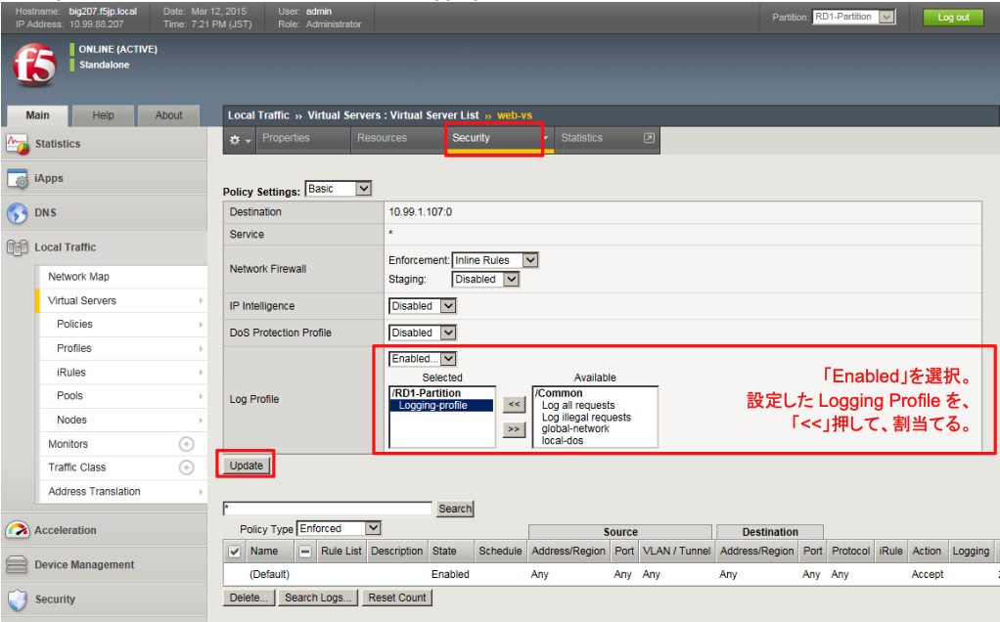

# Logging ProfileのVSへの適用

各バーチャルサーバへ、設定したLogging Profileを適用します。

(1) web-vsを例にとります。

「Local Traffic」→「Virtual Servers」→「Virtual Sever list」で表示された該当VSをクリックし、「Security」タブ→ 「Policies」をクリックすると、以下の画面が表示されます。

「Log Profile」でEnabledを選択し、作成したLogging Profileを割当てます。

(2) その他の全てのバーチャルサーバに対しても、同様の設定を行います。
