# Global向けルール設定

Globalのルール設定を行うので、一旦、パーティションを「Common」に戻し、共通設定を行います。
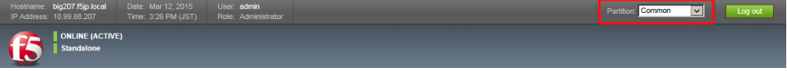

## TCPポートのリスト設定
ここではPort Listを使った設定を行ってみます。

「Security」→「Network Firewall」→「Port Lists」で表示された画面の右上にある「Create」ボタンを押し、現れた画面で以下のように設定します。
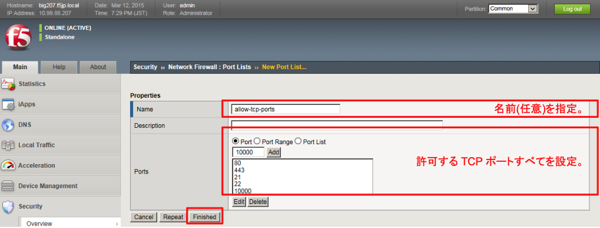

## UDPポートのリスト設定
同様の方法で、UDPポートのリストも設定します。
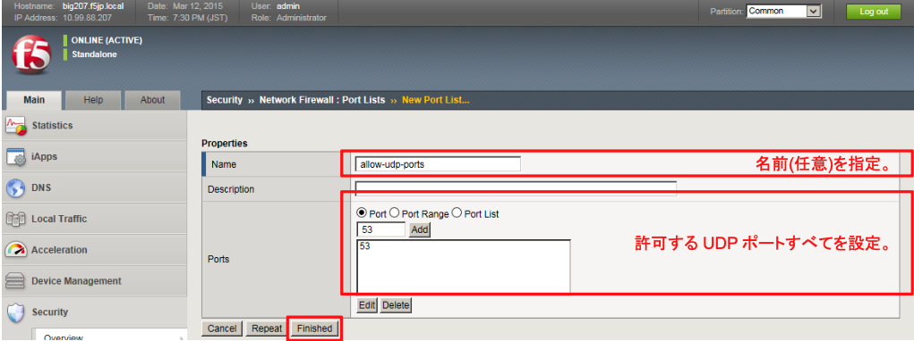

## GlobalのACL設定
Globalでパケットフィルタする設定を行います。

「Security」→「Network Firewall」→「Active Rules」で表示された画面の右上にある「Add」ボタンを押します。
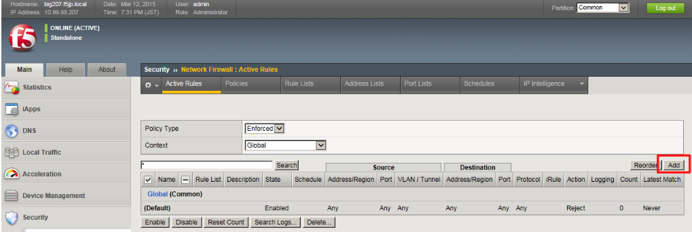

(1) TCP許可用ルール

以下のように設定します。
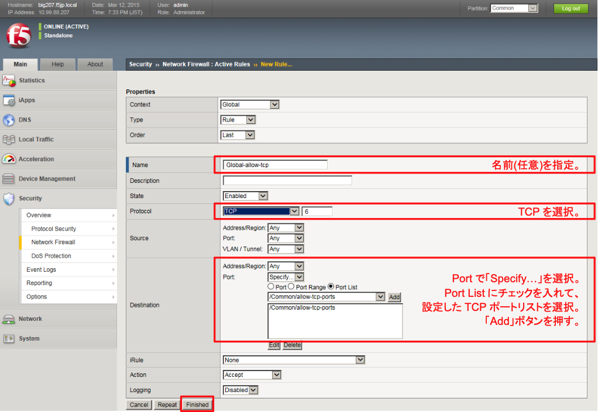

(2) UDP許可用ルール

再度「Add」ボタンを押し、以下のように設定します。
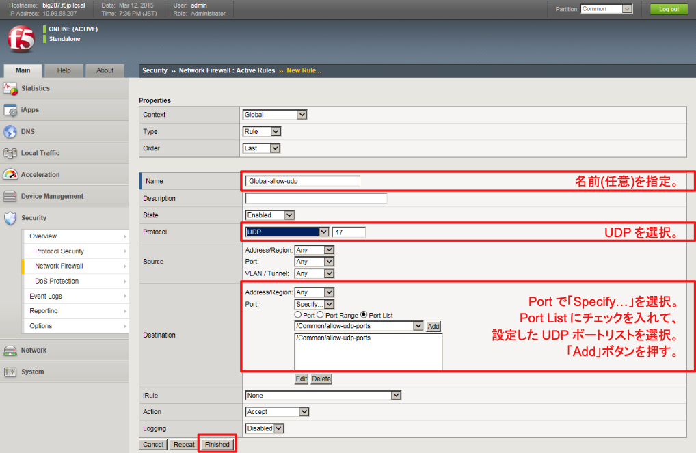

(3) 上記以外は全て拒否するルール

再度「Add」ボタンを押し、以下のように設定します。
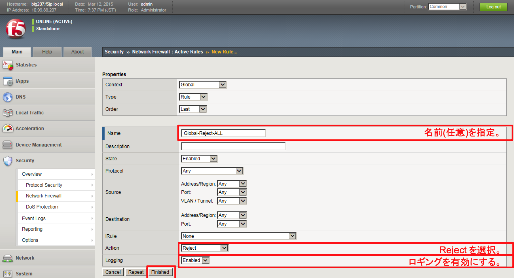

(4) Global ACLは以下のようになります。
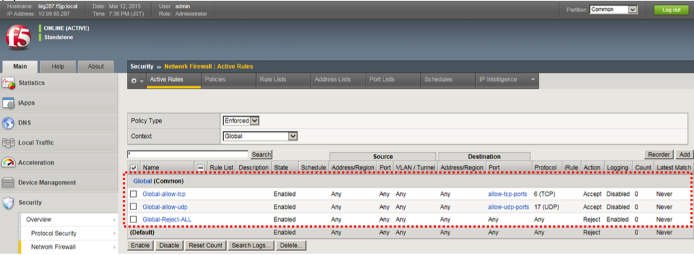

## GlobalのLogging設定
Globalのログ出力は、「global-network」というデフォルトで用意されたLogging Profileの設定変更が必要です。

(1) 「Security」→「Event Logs」→「Logging Profiles」で表示された「global-network」をクリックします。
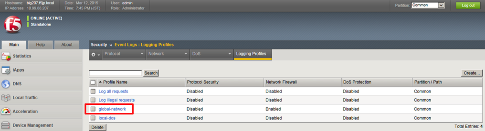

(2) 以下のように設定します。
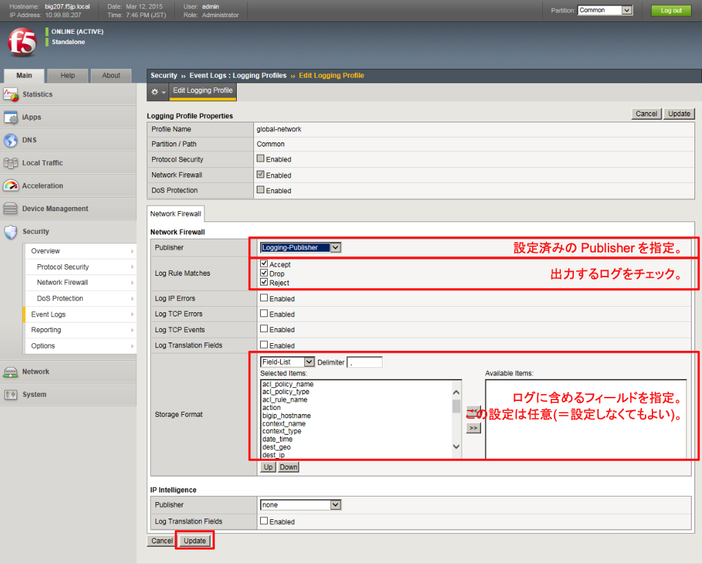

## ログの確認
ログ出力を確認します。

本ガイドのネットワーク構成では、10.99.2.0/24のセグメントにWindows 2008サーバやWindowsクライアントが複数接続されています。

Globalに設定したフィルタ設定では、Windowsは、例えばNetBIOS over TCP/IP(NBT)のようなパケットをデフォルトで出力するので、Global-Reject-ALLルールに合致するため、多数のログが出力されてしまいます。

「Security」→「Event Logs」→「Network」→「Firewall」でログを確認します。
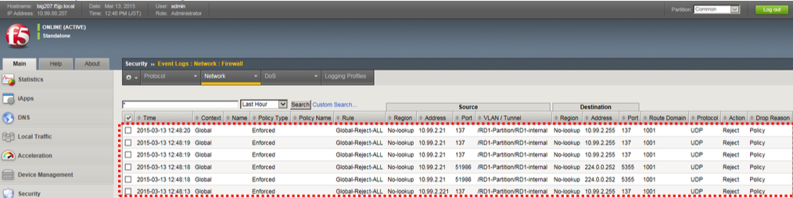

本ガイドのポリシーとしては、「これらのログ出力は必要なし」と決め、以降でログを出力しないよう、設定を行います。

## Windows標準プロトコルのフィルタ設定
Windows標準プロトコルによるパケットは、設定済みの「Global-Reject-ALL」にヒットするので、多数のログが出力されてしまいます。これらのログ出力させないためには、そのルールの前に新しくルールを入れる必要があります。

Route Domain：RD1 (ID:1001)のインタフェースでWindows標準プロコルを検知しているので、RD1用のフィルタリング設定をGlobalに適用することにします。

### IPv4のDrop & ログの無効化

本ガイドでは、10.99.2.0/24のサブネット上にWindowsが接続されています。

RD1(ID:1001)で、「そのアドレスから出力されるパケットを全てDrop & ログ出力はしない」という設定を行います。

(1) 「Security」→「Network Firewall」→「Active Rules」で表示された画面の右上にある「Add」ボタンを押し、表示された画面で以下のように設定します。
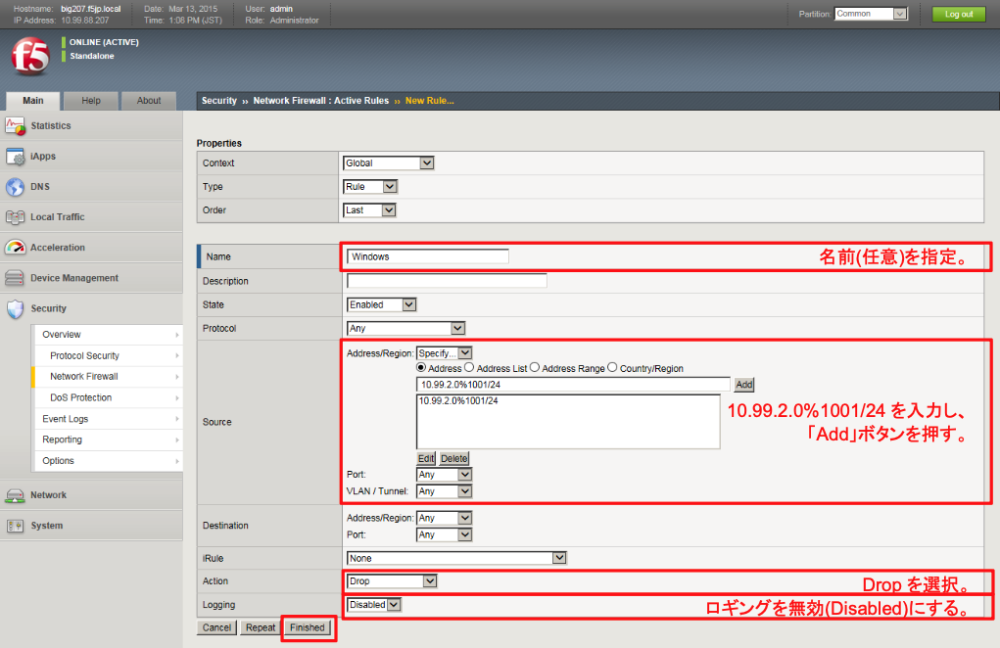

(2) Active Rulesの一覧で、右上の「Reorder」ボタンを押します。

各ルール行の先頭にカーソルを持っていくと、カーソルが「手」のマークに変わります。

ドラッグ＆ドロップで、「Global-Reject-ALL」の前に持って行きます。

移動できたら、「Update」ボタンを押します。

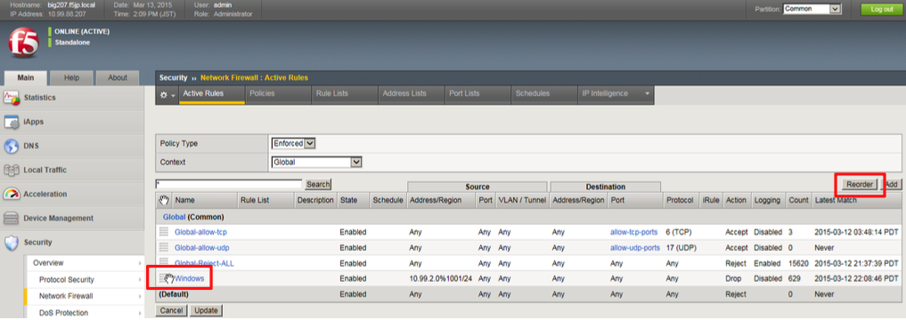

### IPv6のDrop & ログの無効化

Windowsは、IPv4だけでなく、IPv6も標準で動作しています。

IPv6リンクローカルアドレス(fe80::0/64)でパケットを出力しますので、RD1(ID:1001)で、「そのアドレスから出力されるパケットを全てDrop & ログ出力はしない」という設定を行います。

(1) IPv4と同様の方法で設定します。
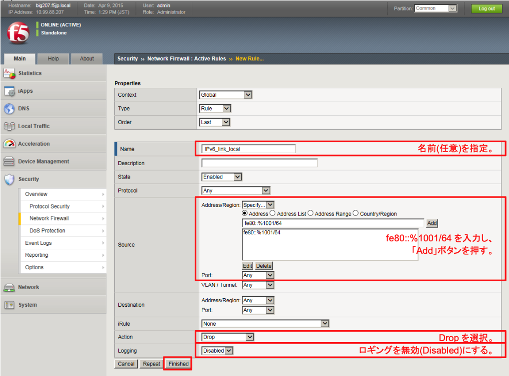

(2) Active Rulesの一覧で、右上の「Reorder」ボタンを押して、「Global-Reject-ALL」の前に移動します。

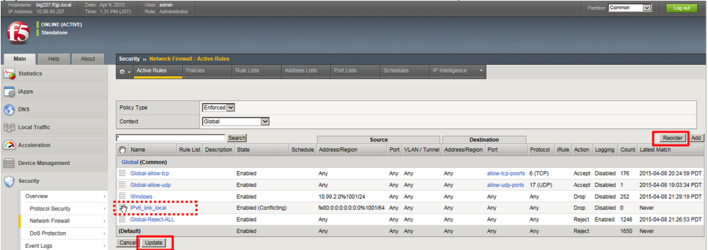

(3) 今一度、「Security」→「Event Logs」→「Network」→「Firewall」でログを確認します。

「Network」タブ→「Firewall」を数回クリックします。

現在時刻とログを比較し、新たな10.99.2.0/24およびfe80::/64からのログが出力されていないことを確認します。

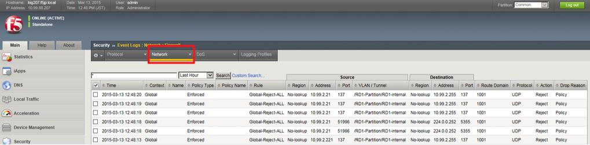