# web-vsのACL設定

パーティションをRD1-Partitionに変更します。
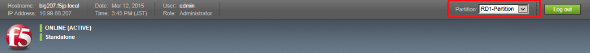

## Rule Listの作成

ここでは、Rule listを使ってみます。

(1) まず、ルールの入れものをつくります。

「Security」→「Network Firewall」→「Rule Lists」で表示された画面の右上にある「Create」ボタンを押すと、以下の画面が現れます。 Nameだけ入力して「Finished」ボタンを押します。
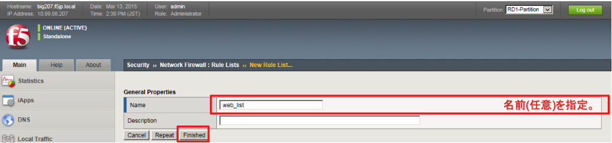

(2) 作成したweb_listをクリックします。
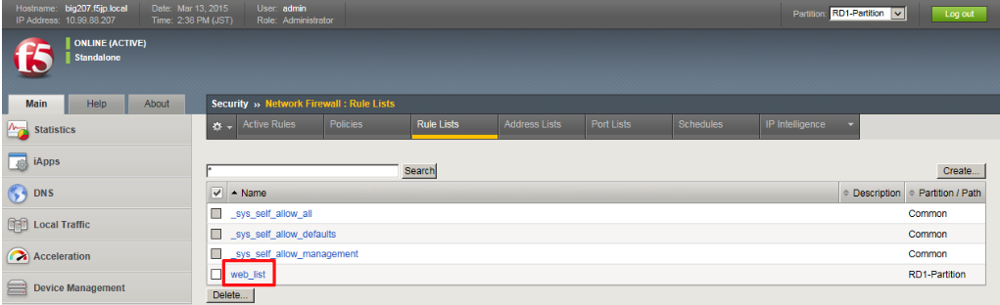

(3) 「Add」ボタンを押します。
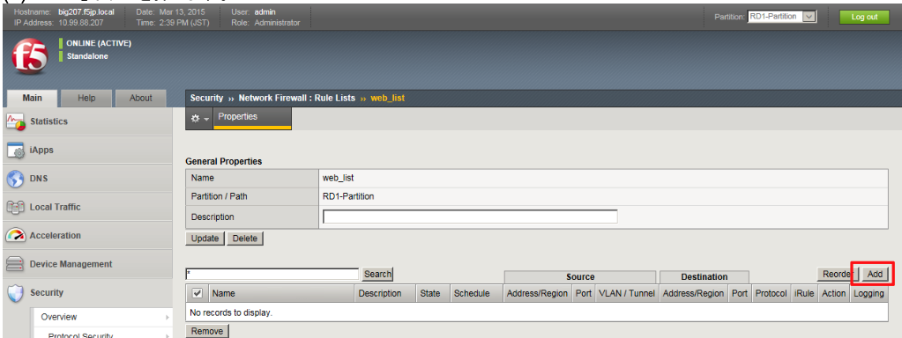

(4) HTTP(80)用ルール以下のように設定します。
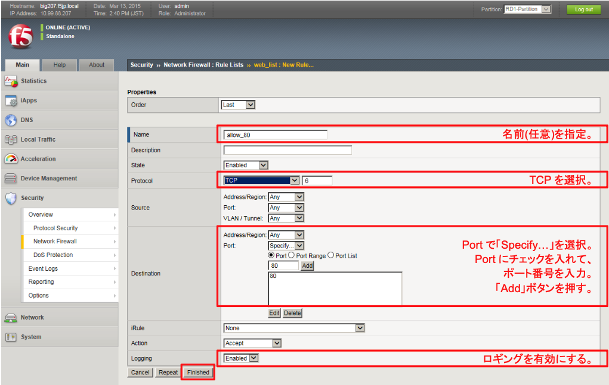

(5) HTTPS(443)用ルール再度「Add」ボタンを押し、以下のように設定します。
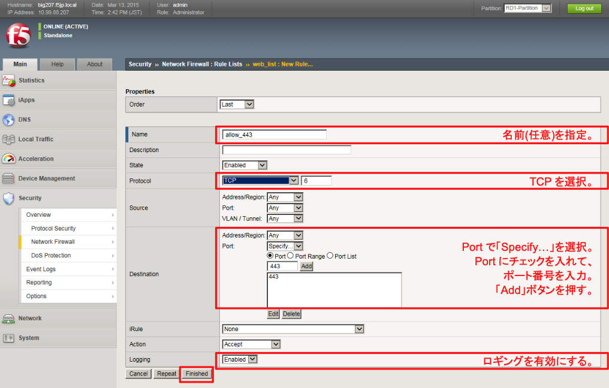

(6) Proxy(Squid)経由のIPアドレス(10.99.4.228)を拒否するルール

通信テストで、拒否ルールが正常に動作していることを確認しやすいように、本ガイドではその対象を10.99.4.228 としました。再度「Add」ボタンを押し、以下のように設定します。
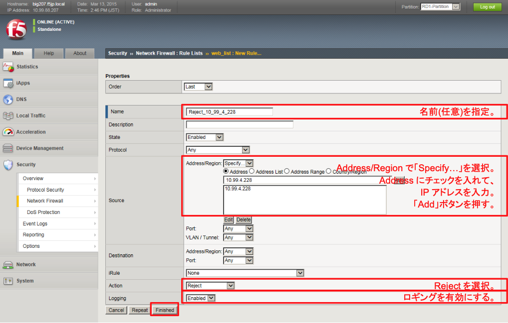

(7) ルールは上から評価されるので、このように拒否ルールが一番下にあると、HTTP(80)、HTTPS(443)は通過してしまいます。そこで、ルールの順番を変更します。

「Reorder」ボタンを押します。
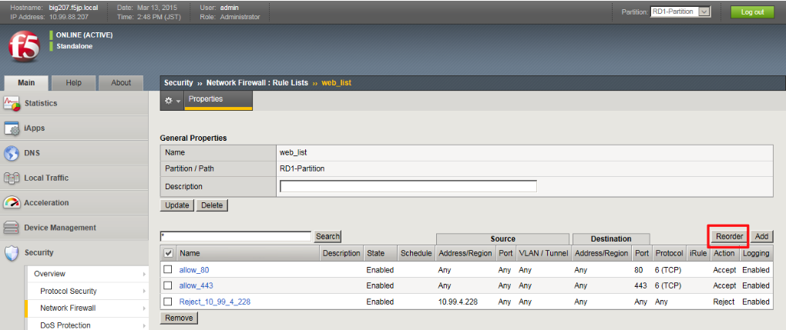

(8) 各ルールの先頭にマウスを移動すると、カーソルが手のマークに変わります。

拒否ルールをドラッグして、一番上に移動し、「Update」ボタンを押します。
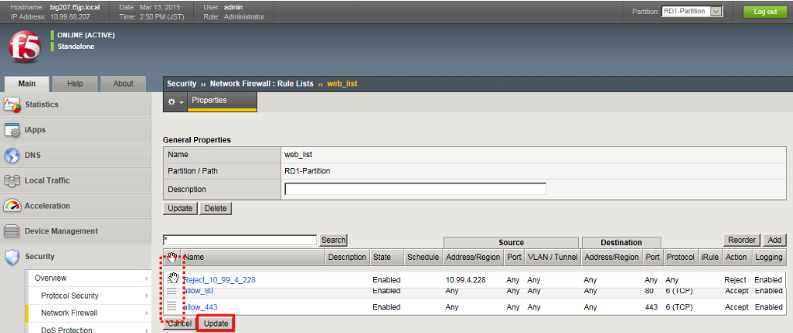

(9) 拒否ルールが一番上に移動します。
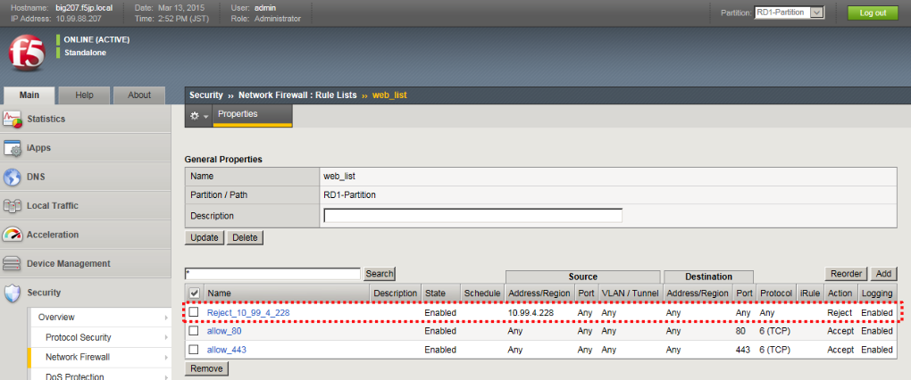

## ACLの適用
Rule Listを使って作成したACLを、web-vsへ適用します。

(1) 「Local Traffic」→「Virtual Servers」→「Virtual Sever list」で表示された該当VS(web-vs)をクリックし、 「Security」タブ→「Policies」をクリックすると、以下の画面が表示されます。「Add」ボタンを押します。
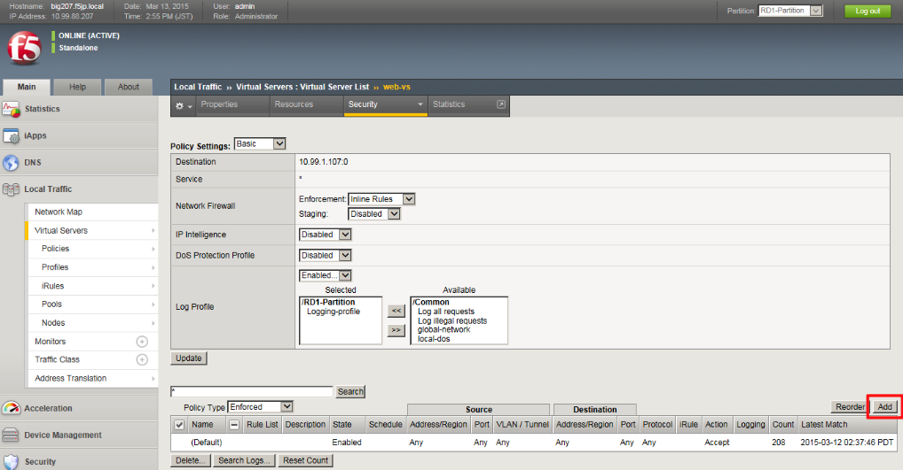

(2) 以下のように設定します。
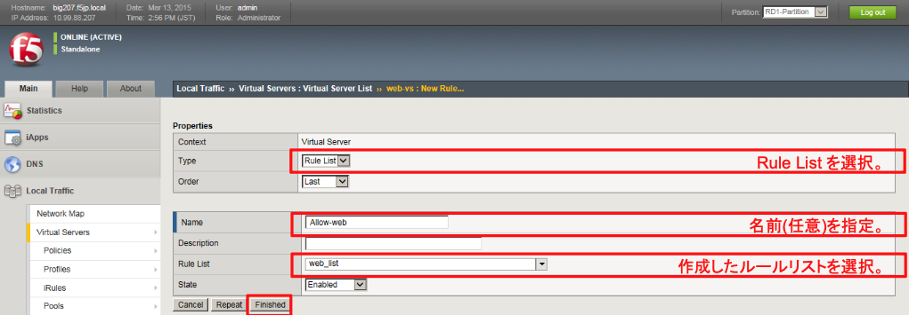

(3) 以下の状態になります。
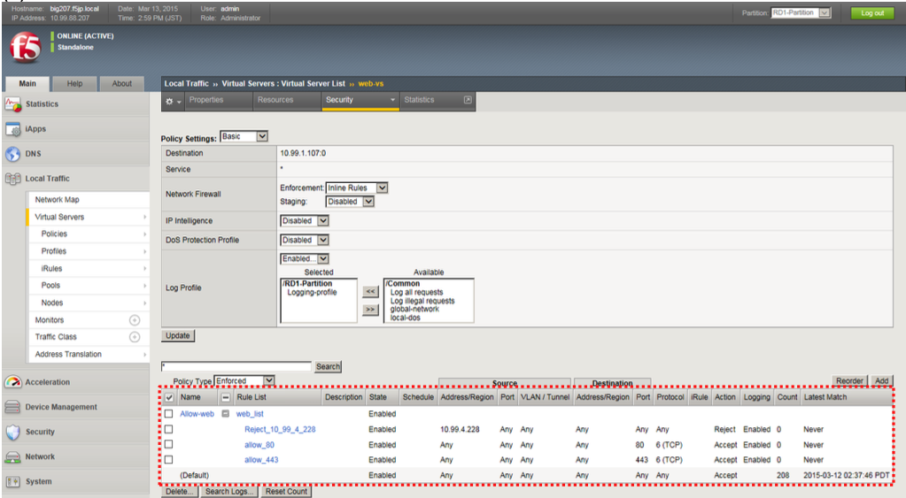

(4) 全拒否ルールの追加デフォルトでは、ルールにヒットしなかったパケットはAcceptとなっています。

このままでは、全てのパケットが通過してしまうので、最後に全拒否ルールを入れます。

再度、「Add」ボタンを押し、現れた画面で以下のように設定します。
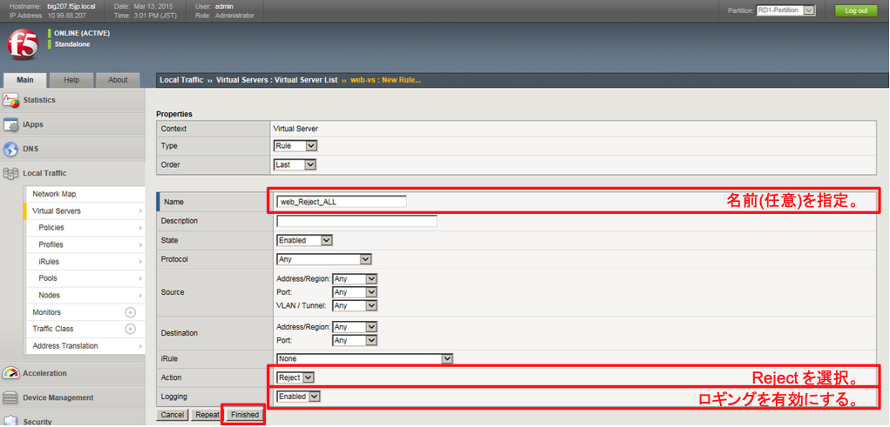

(5) 以下の状態になります。これでweb-vs用のACLは完成です。
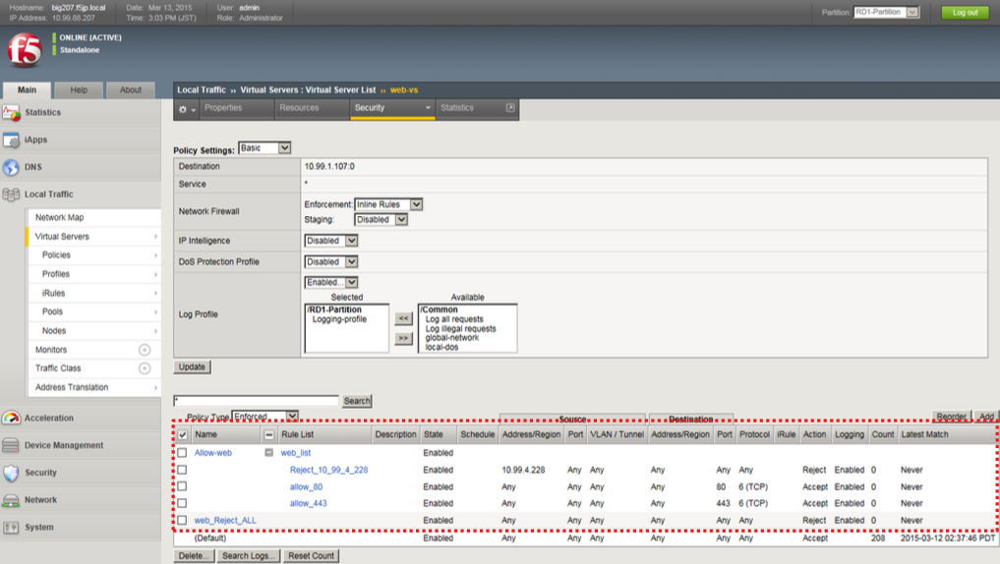