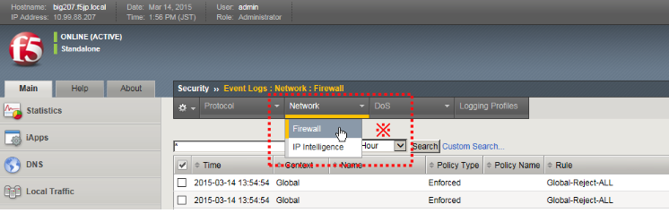
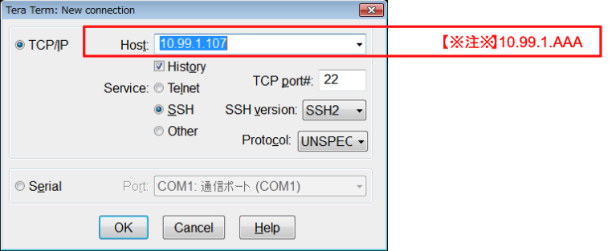

# web-vsの通信確認

期待通りのフィルタができていることを確認します。

また、それぞれの確認のタイミングで、ログが出力されていることを確認します。

「Security」→「Event Logs」→「Network」→「Firewall」でログを確認します。

※ ※ログ表示を更新するには、「Network」タブ→「Firewall」をクリックしてください。

(1) クライアントのブラウザから、web-vsへHTTPでアクセス → 期待する動作：OK

1. http://10.99.1.AAA 【※注※】

2. ログを確認

(2) クライアントのブラウザから、web-vsへHTTPSでアクセス → 期待する動作：OK

1. https://10.99.1.AAA 【※注※】

2. ログを確認

(3) クライアントのブラウザをProxy(Squid)経由に変更

(4) クライアントのブラウザから、(Proxy(Squid)経由で) web-vsへHTTPでアクセス → 期待する動作：NG

1. http://10.99.1.AAA 【※注※】

2. ログを確認

(5) クライアントのブラウザから、(Proxy(Squid)経由で) 2つのVSへHTTPSでアクセス → 期待する動作：NG

3. https://10.99.1.AAA 【※注※】

4. ログを確認

(6) クライアントのブラウザのProxy(Squid)設定を解除

(7) クライアントのTeraTermから、wild-XXX-vsへSSHアクセス → 期待する動作：NG

1.  SSHアクセス

2.  ログを確認
