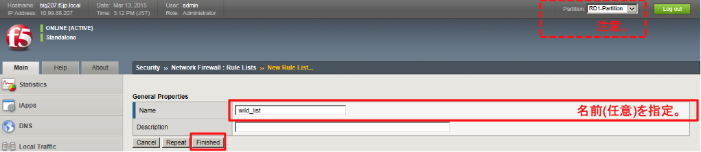
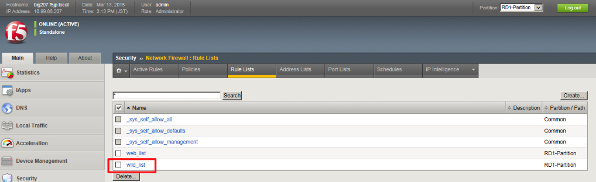
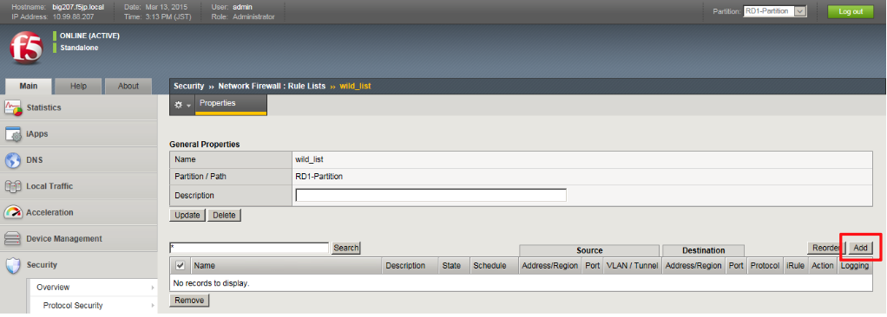
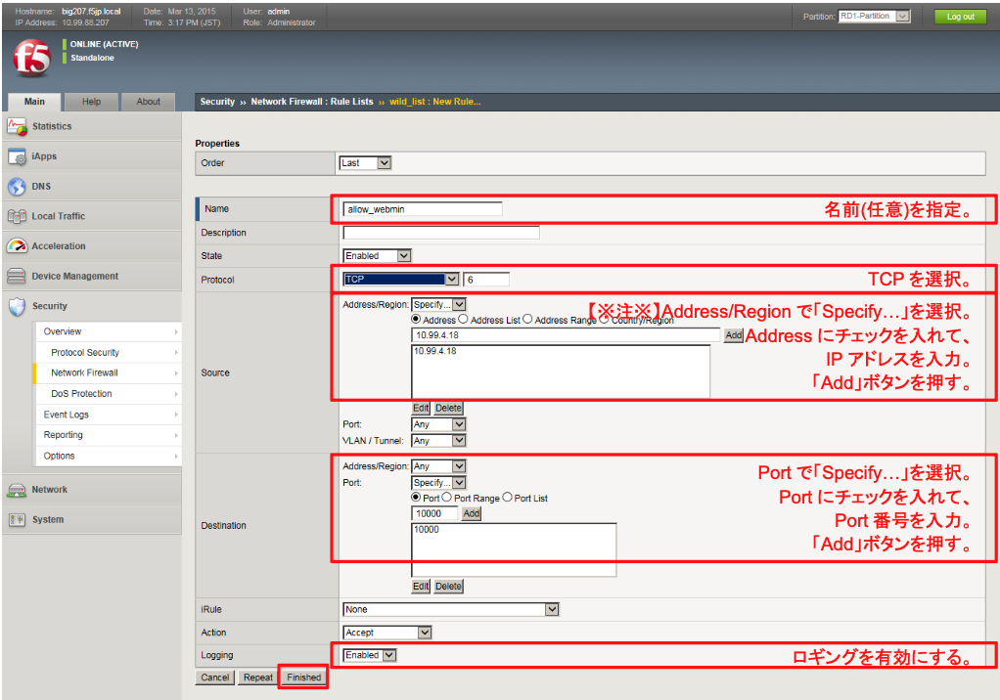
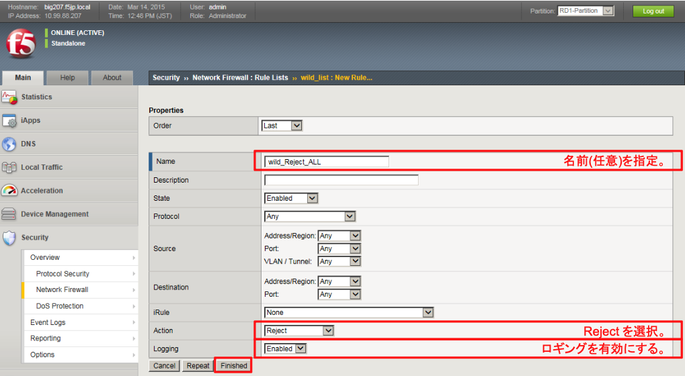
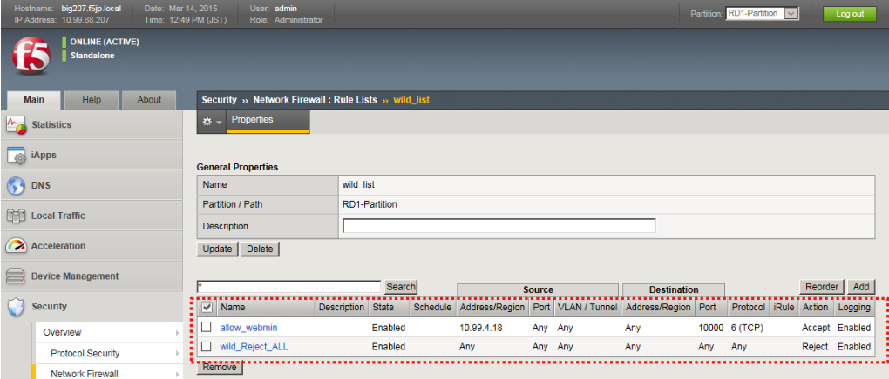
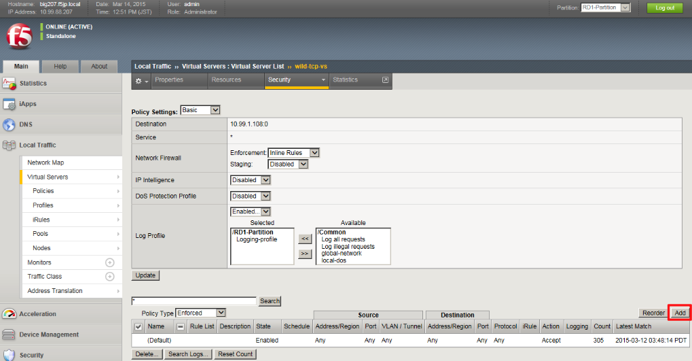
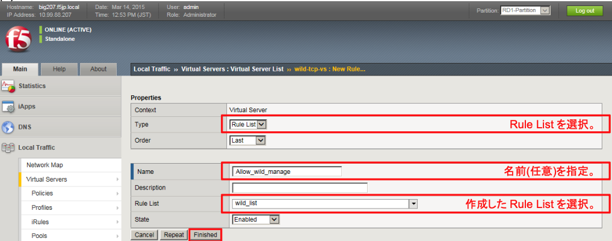
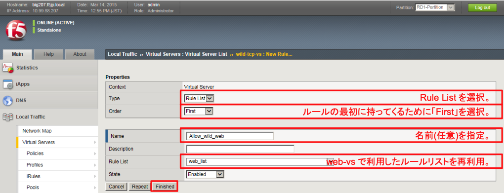
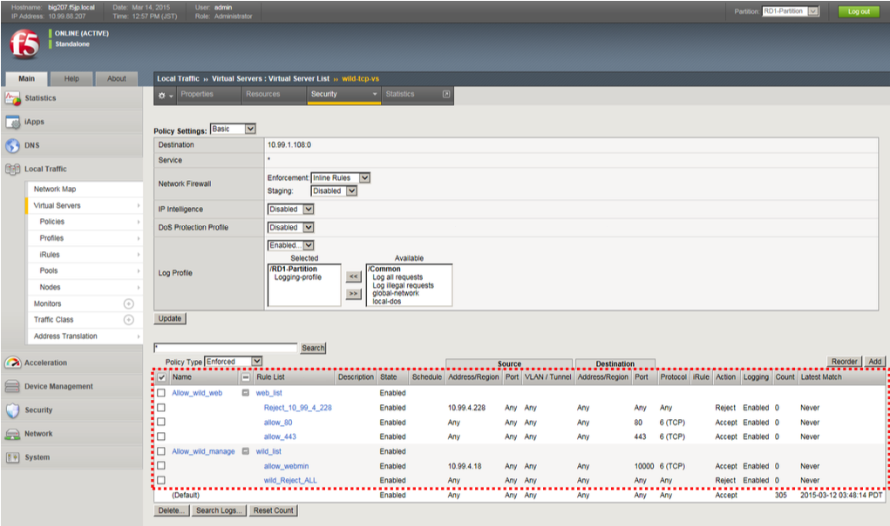

# wild-tcp-vsのACL設定

## Rule Listの作成

ここでも、Rule listを使ってみます。

(1) まず、ルールの入れものをつくります。

「Security」→「Network Firewall」→「Rule Lists」で表示された画面の右上にある「Create」ボタンを押すと、以下の画面が現れます。 Nameだけ入力して「Finished」ボタンを押します。

Partitionに注意してください。Commonになっていたら,RD1-Partitionに変更してください。

(2) 作成したwild_listをクリックします。

(3) 「Add」ボタンを押します。

(4) 10.99.4.mmが管理者のIPアドレスであると想定し、webminをそのIPアドレスのみ許可することとします。
以下のように設定します。

(5) ここでは、全拒否ルールを、このRule Listの中で設定してみます。

再び「Add」ボタンを押して、以下のように設定します。

(6) このRule Listは以下の状態になります。

## ACLの適用
Rule Listを使って作成したACLを、wild-tcp-vsへ適用します。

(1) 「Local Traffic」→「Virtual Servers」→「Virtual Sever list」で表示された該当VSをクリックし、「Security」タブ→ 「Policies」をクリックすると、以下の画面が表示されます。「Add」ボタンを押します。

(2) 以下のように設定します。

(3) 本VSでは、HTTP(80)とHTTPS(443)も提供します。

ここでは、web-vsで作ったRule Listを再利用することにします。

再び「Add」ボタンを押して、以下のように設定します。

(4) 以下の状態になります。これでwild-tcp-vs用のACLは完成です。
