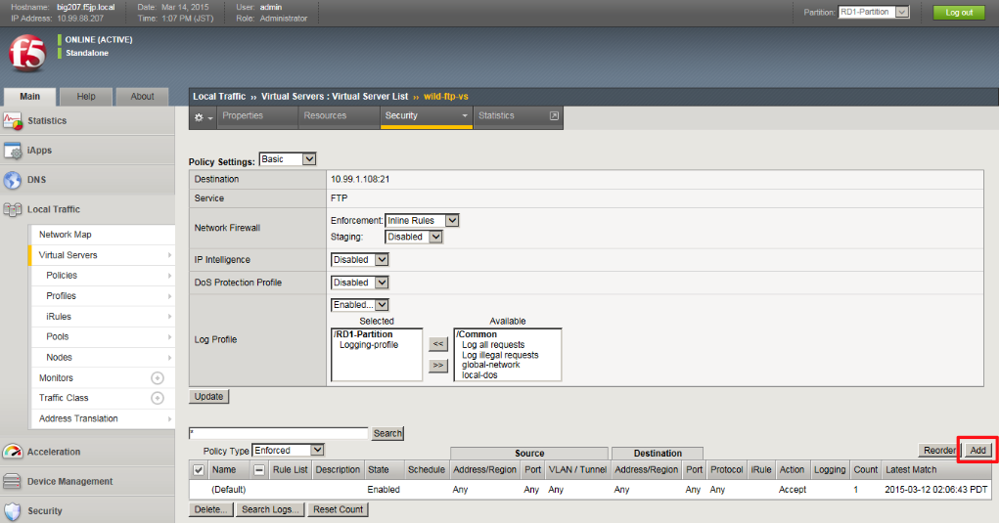
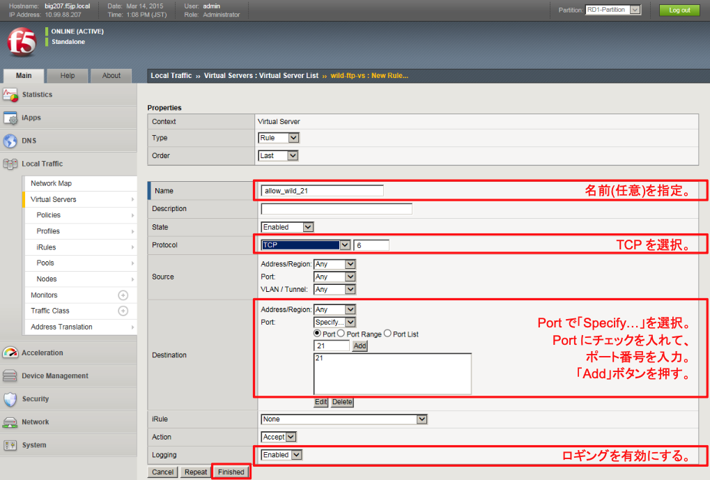
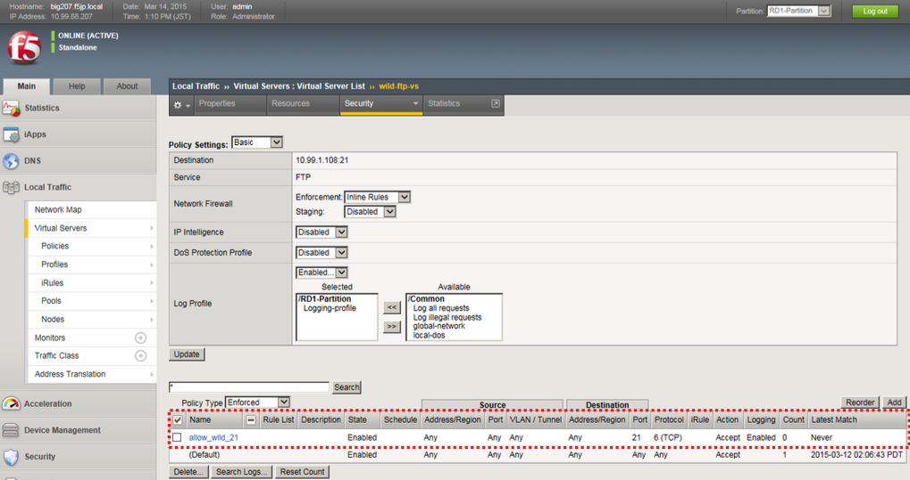

# wild-ftp-vs用のACL設定

本VSでも、通信ログを取得することのみを目的としたルールを適用します。

ここでも、VSへ直接ルールを設定してみます。

(1) 「Local Traffic」→「Virtual Servers」→「Virtual Sever list」で表示された該当VSをクリックし、「Security」タブ→ 「Policies」をクリックすると、以下の画面が表示されます。「Add」ボタンを押します。

(2) 以下のように設定します。

(3) 以下の状態になります。これでwild-ftp-vs用のACLは完成です。
