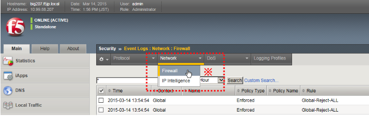
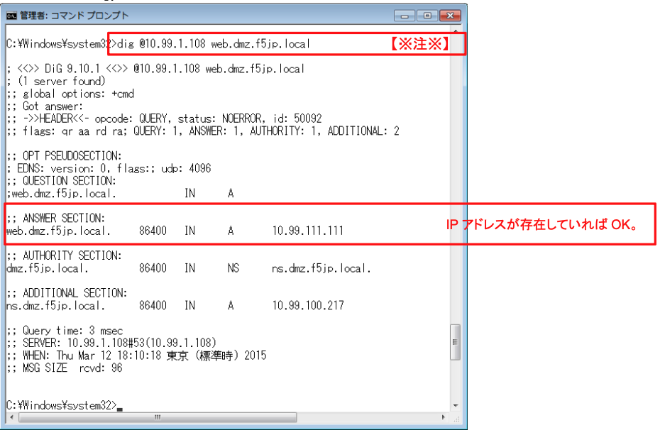
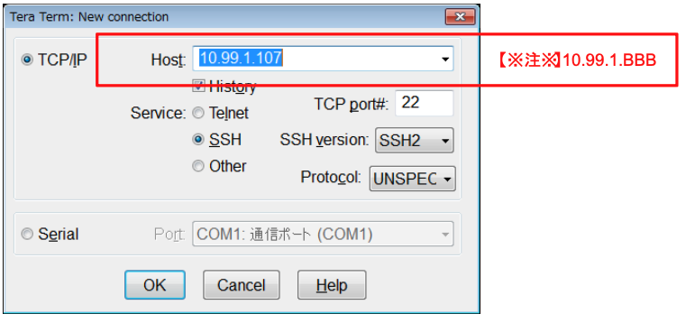
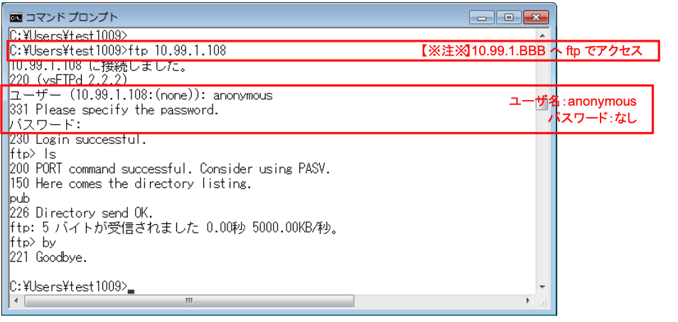

# Wild-XXX-vsの通信確認

期待通りのフィルタができていることを確認します。

また、それぞれの確認のタイミングで、ログが出力されていることを確認します。

「Security」→「Event Logs」→「Network」→「Firewall」でログを確認します。

※ ※ログ表示を更新するには、「Network」タブ→「Firewall」をクリックしてください。

(1) クライアントのブラウザから、wild-XXX-vsへHTTPでアクセス → 期待する動作：OK

1. http://10.99.1.BBB 【※注※】
2. ログを確認

(2) クライアントのブラウザから、wild-XXX-vsへHTTPSでアクセス → 期待する動作：OK

1. https://10.99.1.BBB 【※注※】
2. ログを確認

(3) クライアントのブラウザをProxy(Squid)経由に変更

(4) クライアントのブラウザから、(Proxy(Squid)経由で) wild-XXX-vsへHTTPでアクセス → 期待する動作：NG

1. http://10.99.1.BBB 【※注※】
2. ログを確認

(5) クライアントのブラウザから、(Proxy(Squid)経由で) wild-XXX-vsへHTTPSでアクセス → 期待する動作：NG

1. https://10.99.1.BBB 【※注※】
2.  ログを確認

(6) クライアントのブラウザのProxy(Squid)設定を解除

(7) クライアントのコマンドプロンプトから、digでDNSアクセス → 期待する動作：OK

1. DNSクエリの実行

```sh
# dig @10.99.1.BBB web.dmz.f5jp.local 【※注※】
または
# dig @10.99.1.BBB mail.dmz.f5jp.local 【※注※】
```

例：web.dmz.f5jp.local【※注※】IPアドレスが存在していればOK。


2.  ログを確認

(8) クライアントのTeraTermから、wild-XXX-vsへSSHアクセス → 期待する動作：NG

1.  SSHアクセスの実行


2.  ログを確認

(9) クライアントのコマンドプロンプトから、Wild-XXX-vsへFTPでアクセス → 期待する動作：OK

1.  ftpアクセスの実行


2.  ログを確認
