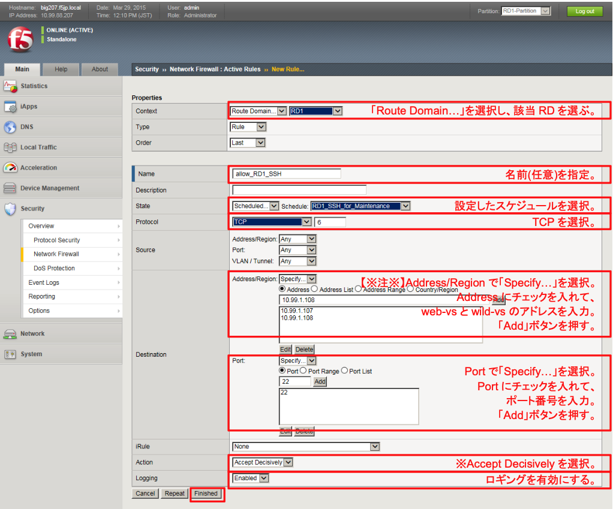
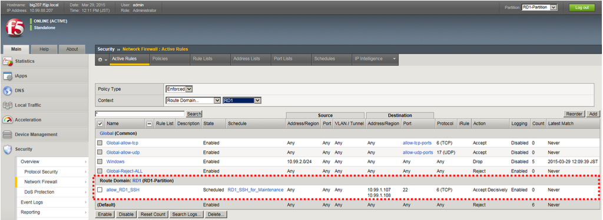

# ACL設定とスケジュールの関連付け

「Security」→「Network Firewall」→「Active Rules」で表示された画面の右上にある「Add」ボタンを押し、現れた画面で以下のように設定します。

※ Actionで「Accept Decisively」を選択することで、このルールでヒットしたら、以降に評価されるルール(Virtual Serverに設定されたルール)はバイパスされます。言い換えますと、このルールにヒットすると、他ルールの影響は受けません。

以下の状態になります。

これで、インターネット側からweb-VSとwild-vsへのSSHが、ある一定時間だけ通るようになります。
