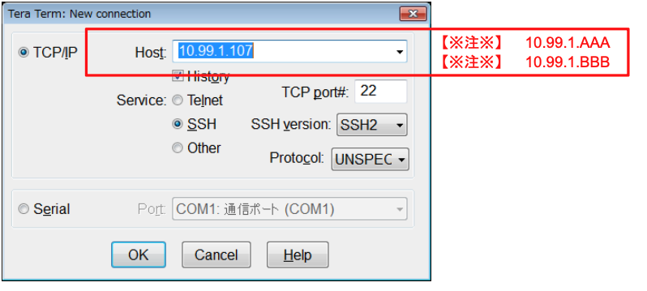
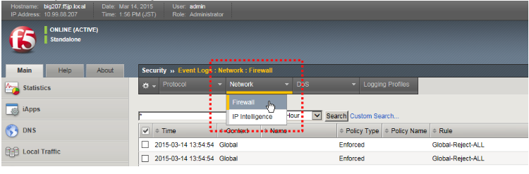

# スケジューリングの動作確認

指定時間には、SSHが通過することを確認します。

クライアントのTeraTermから、２つのVSへSSHアクセス → 期待する動作：OK

1. SSHアクセス


```
User name: user 
Password: user
```

2. ログを確認

ログが出力されていることを確認します。

「Security」→「Event Logs」→「Network」→「Firewall」でログを確認します。

ログ表示を更新するには、「Network」タブ→「Firewall」をクリックしてください。
