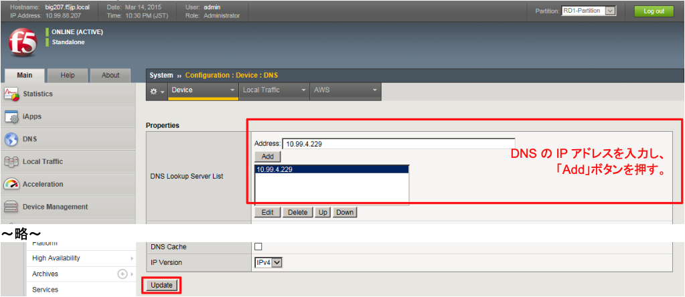

# DNSの設定

IPインテリジェンスは、5分に1回、インターネットを使ってIPレピュテーションデータベースを取り込みますが、そのアクセスには、DNSによるアドレス解決を必要とします。

本ガイドでは、図中のDNS Server：10.99.4.229を指定します。

「System」→「Configuration」→「Device」→「DNS」で表示された画面で、以下のように設定します。
