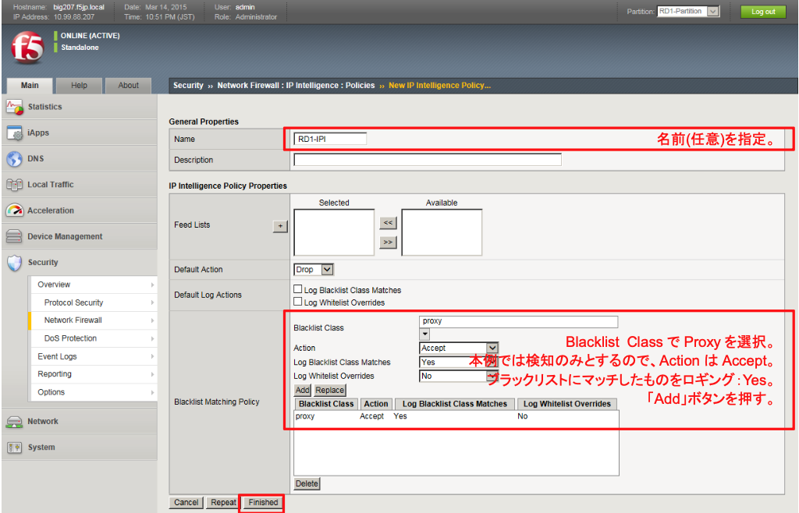
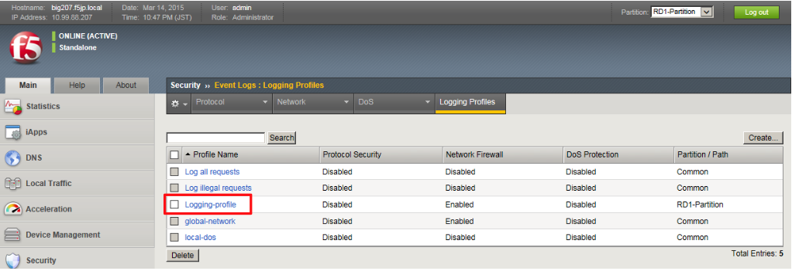
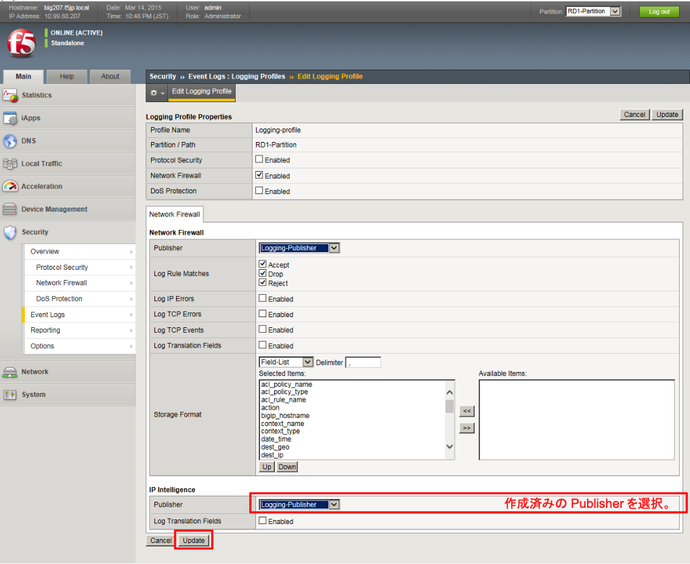
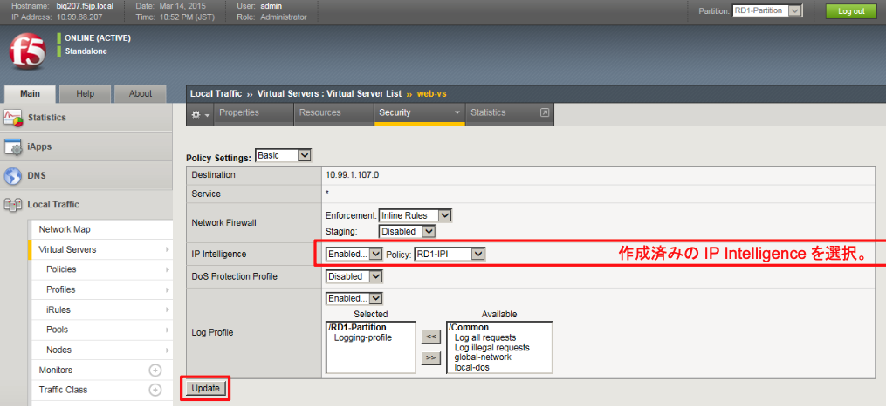

# IP Intelligenceの設定

## IP Intelligence Policyの設定
どのようなポリシーでIPインテリジェンスを利用するのかを指定します。

本ガイドでは、Proxyを検知だけ行い、ブロックはしないでログ出力だけ実施する、というポリシーを適用します。

「Security」→「Network Firewall」→「IP Intelligence」→「Policies」で表示された画面の右上にある「Create」ボタンを押し、現れた画面で以下のように設定します。

## Logging ProfileでIP Intelligenceを有効化 IPインテリジェンスのログ出力を行うには、Logging Profileでの指定も必要です。

(1) 「Security」→「Event Logs」→「Logging Profiles」で表示された作成済みの「Logging-profile」をクリックして開きます。以下のように設定します。

(2) 現れた画面で、以下のように設定変更します。

## IP Intelligenceの適用

各Virtual ServerにIP Intelligenceを適用します。

(1) 「Local Traffic」→「Virtual Servers」→「Virtual Sever list」で表示されたweb-vsをクリックし、「Security」タブ→ 「Policies」をクリックして現れた画面で、以下のように設定します。

(2) 同様に、Wild-tcp-vsにも設定します。

(3) Wild-ftp-vs、wild-dns-vsにもそれぞれ同様に設定します。
