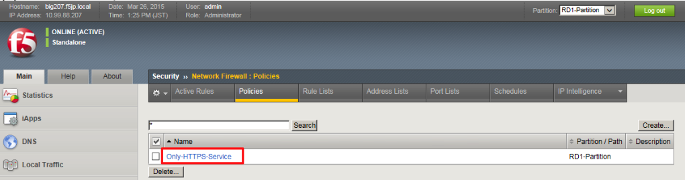
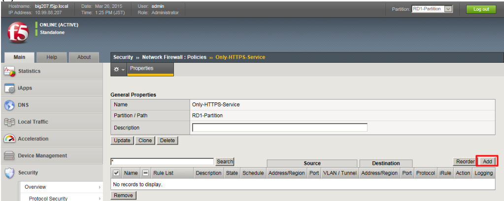
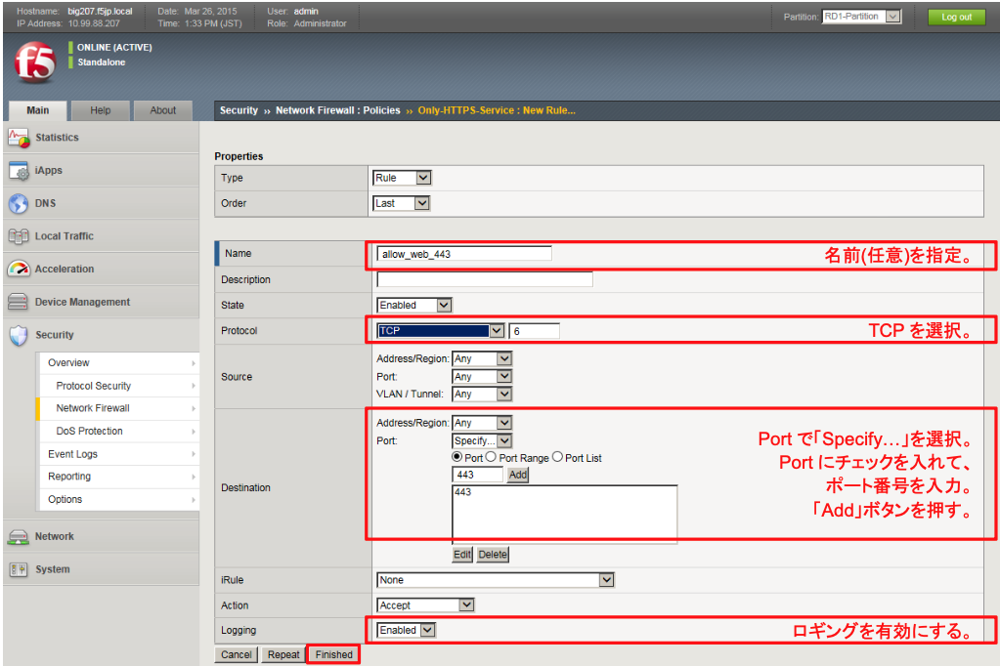
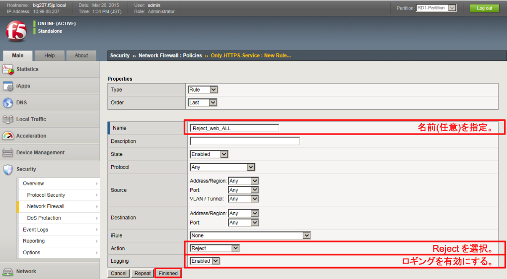
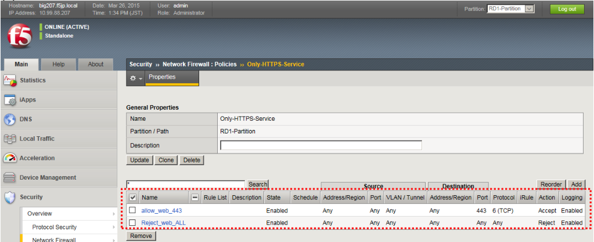

# ステージング用ポリシーの設定

ステージング用ポリシーの設定方法を示します。

(1) 「Security」→「Network Firewall」→「Policies」で表示された画面の右上にある「Create」ボタンを押すと、以下の画面が表示されます。「Name」だけ入力して「Finished」ボタンを押します。

(2) 作成したPolicyをクリックします。

(3) 「Add」ボタンを押します。

(4) HTTPS(443)の許可設定以下のように設定します。

(5) 全拒否ルールの設定今一度、「Add」ボタンを押して、以下のように設定します。

(6) 以下の状態になります。

(7) VSへのPolicy割当て 

「Local Traffic」→「Virtual Servers」→「Virtual Sever list」で表示されたweb-vsをクリックし、「Security」タブ→ 「Policies」をクリックし、現れた画面で以下のように設定します。

