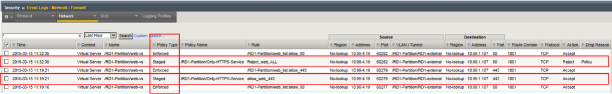
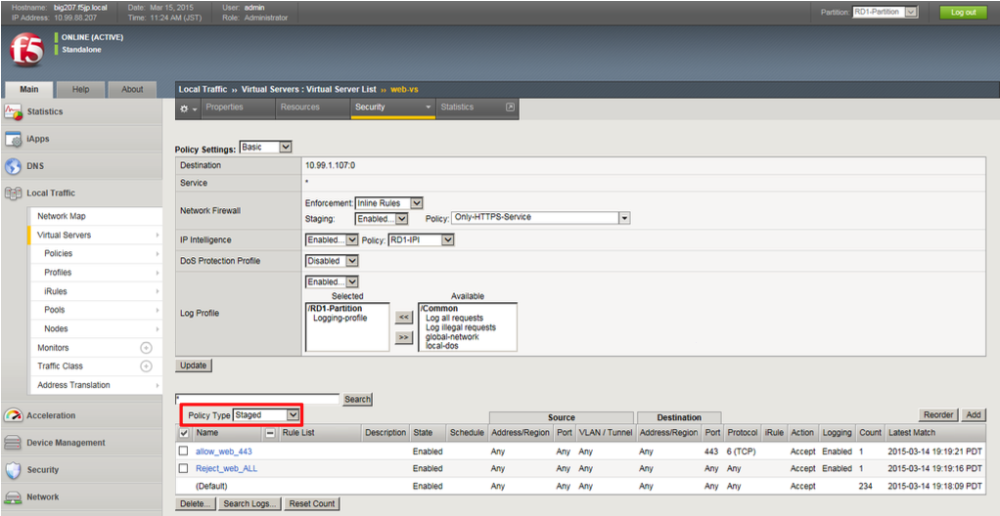

# Stagingログの確認

ステージングポリシーに合致する通信を発生させ、ログを確認します。

## Web-vsへアクセス 
(1) クライアントのブラウザから、web-vsへHTTPでアクセス → 期待する動作：OK 

http://10.99.1.AAA 【※注※】

(2) クライアントのブラウザから、web-vsへHTTPSでアクセス → 期待する動作：OK 

https://10.99.1.AAA 【※注※】 

## ログの確認
「Security」→「Event Logs」→「Network」→「Firewall」で、設定したPolicyがStagingとして検知できていることを確認します。

Policy TypeがStagedになっているログで、HTTP(80)はRejectされ、HTTPS(443)はAcceptとなっていることを確認します。

## Stagingポリシーの確認方法
Staging状態のポリシーは初期画面では表示されないので、確認する方法をお伝えしておきます。

「Local Traffic」→「Virtual Servers」→「Virtual Sever list」で表示されたweb-vsをクリックし、「Security」タブ→ 「Policies」をクリックすると、以下の画面が表示されます。Policy Type:をStagedにすることで確認できます。
