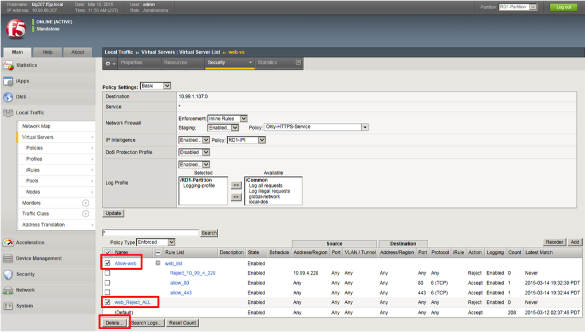
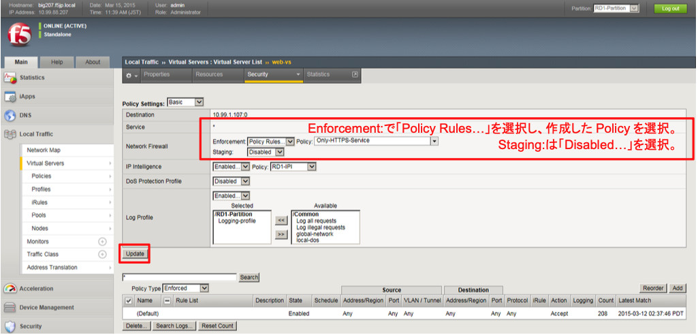
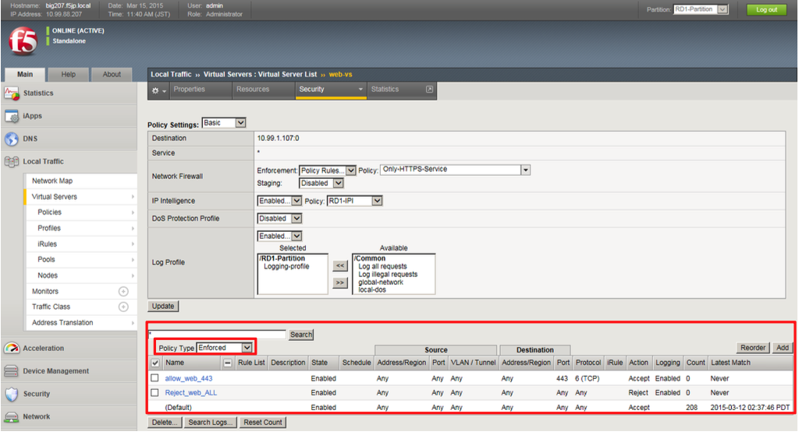

# ステージングから本番適用への変更

ステージングのログを確認し、そのACLに問題ないことを確認できたら、本番環境へ移行します。

(1) 「Local Traffic」→「Virtual Servers」→「Virtual Sever list」で表示されたweb-vsをクリックし、「Security」タブ→ 「Policies」をクリックすると、以下の画面が表示されます。

まず、Allow-webとweb_Reject_Allにチェックを入れ、「Delete」ボタンを押します。

(2) 次に、以下のように設定します。

(3) 以下のように、PolicyがStagedからEnforcedに変わります。
