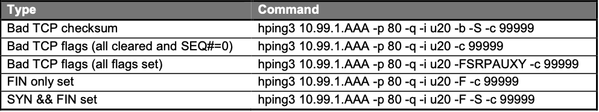

# サーバから攻撃を実行

ネットワーク図中の10.99.4.227から、hping3を使って、以下のコマンドを実行します。



(1) 10.99.88.227へSSHでログインします。

```
Username: user
Password: user 
```

(2) /rootフォルダ直下の、自身のVSアドレスを持つものを実行します。

例：10.99.1.107への攻撃用スクリプト

```sh
[user@PEOLD-Cent-227 ~]$ ls -l
total 64
～一部省略～
-rwxr-xr-x 1 root root 283 Mar 16 12:39 to_10_99_1_101_hping3_attack.sh
-rwxr-xr-x 1 root root 283 Mar 16 12:40 to_10_99_1_103_hping3_attack.sh
-rwxr-xr-x 1 root root 283 Mar 16 12:40 to_10_99_1_105_hping3_attack.sh
-rwxr-xr-x 1 user user 283 Mar 16 12:34 to_10_99_1_107_hping3_attack.sh ←これを使います。
-rwxr-xr-x 1 root root 277 Mar 16 12:36 to_10_99_1_91_hping3_attack.sh
-rwxr-xr-x 1 root root 277 Mar 16 12:37 to_10_99_1_93_hping3_attack.sh
-rwxr-xr-x 1 root root 278 Mar 16 12:38 to_10_99_1_95_hping3_attack.sh
-rwxr-xr-x 1 root root 278 Mar 16 12:39 to_10_99_1_97_hping3_attack.sh
drwxr-xr-x. 2 user user 4096 Mar 11 17:04 Videos
実行；
[user@PEOLD-Cent-227 ~]# ./to_10_99_1_107_hping3_attack.sh
[sudo] password for user: user
```
