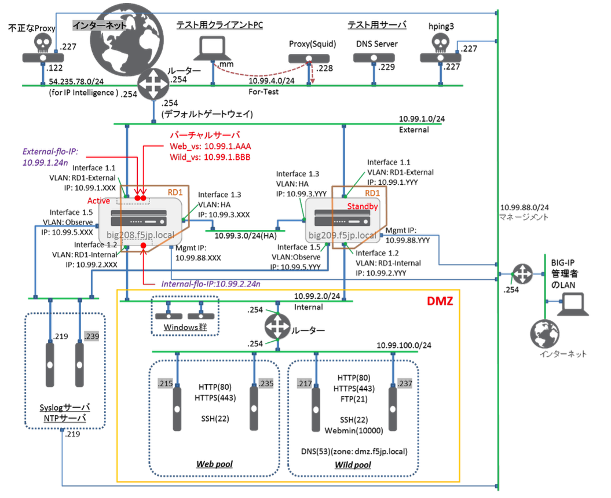
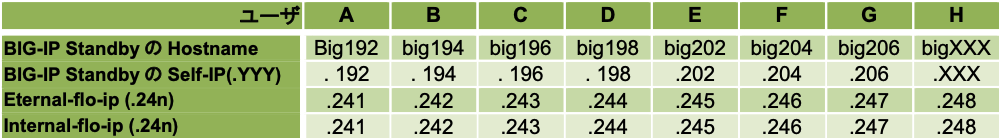

# 冗長化のネットワークサンプル

もう一台BIG-IPを追加して、L3構成の冗長化設定を行います。

BIG-IP間のHA (High Availability) VLANは、冗長化の制御プロトコルをやり取りする専用のVLANです。

ExternalやInternal VLANを利用することも可能ですが、HA専用のVLANを追加することを推奨しています。

よって、本構成においては、HA VLANを追加しています。

PEOLDで利用するIPアドレス(ホストアドレス):

【※注※】：このマークのところでご利用頂く値です。
