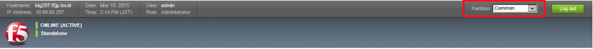
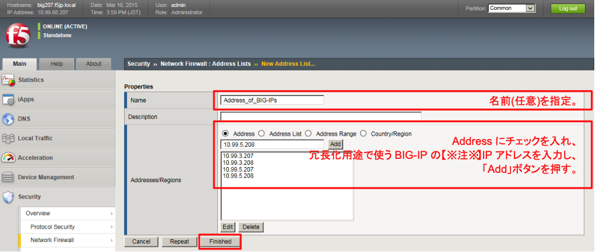
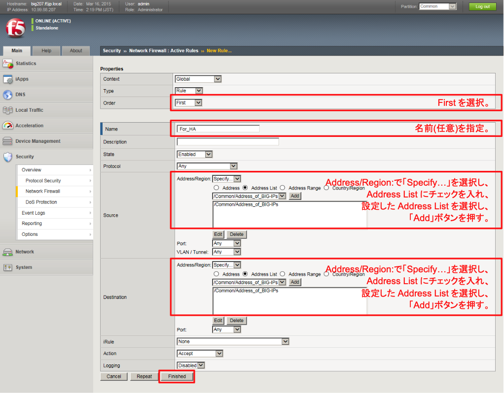
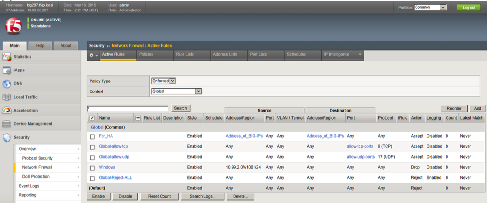

# 制御プロトコルを許可するACL

GlobalでACLを設定しているため、このままだと制御用プロトコルが通りません。

ここでは、Address-listを使って、BIG-IPのIPアドレスからの通信は許可する設定を行います。

(1) bigXXX.f5jp.localにて、パーティションをCommonに戻します。

(2) 「Security」→「Network Firewall」→「Address Lists」で表示された画面の右上にある「Create」ボタンを押し、現れた画面で以下のように設定します。

(3) 「Security」→「Network Firewall」→「Active Rules」で表示された画面の右上にある「Add」ボタンを押すと、以下の画面が現れます。以下のように設定します。

(4) 以下のような状態になります。
