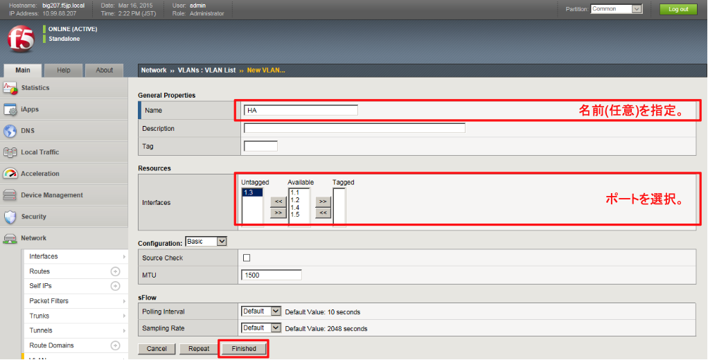
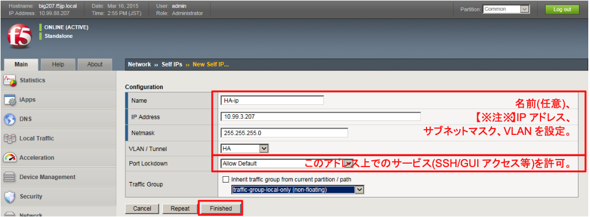
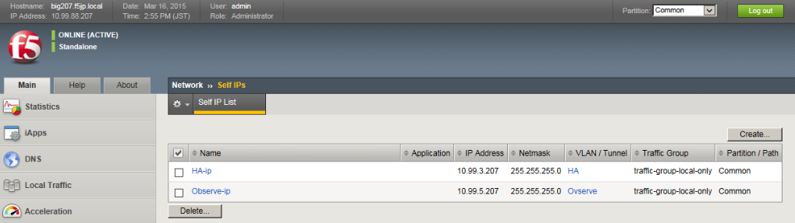
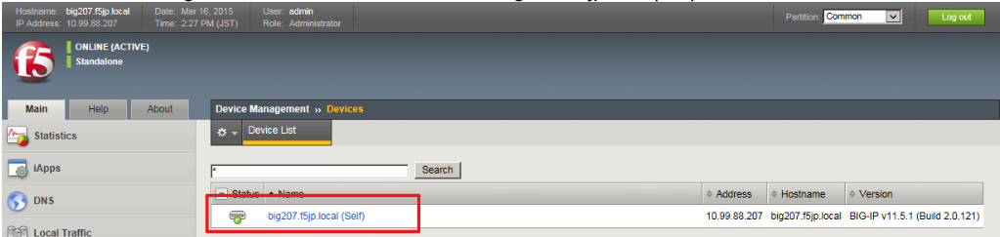
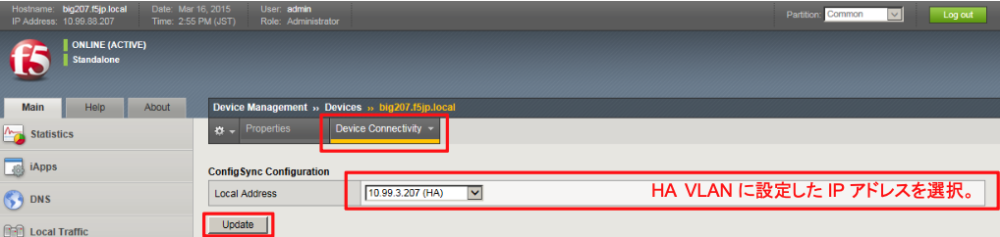
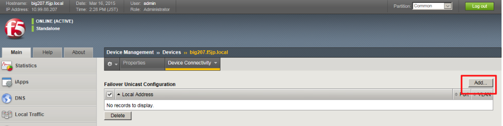
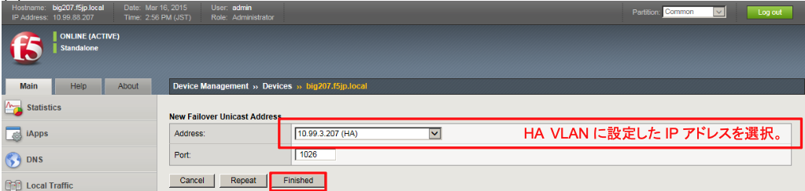
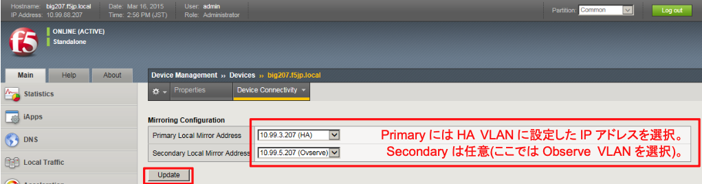

# Active機(bigXXX.f5jp.local)の設定

## HA VLANの設定
「Network」→「VLANs」で表示された画面の右上にある「Create」ボタンを押し、HA用VLANを設定します。

## HA VLANのSelf IP設定
「Network」→「Self IPs」で表示された画面の右上にある「Create」ボタンを押し、HA用VLANのIPを設定します。

(1) 一覧は以下のような状態になります。

## Device Managementの設定
次に、「Device Management」→「Devices」で、自分自身：bigXXX.f5jp.local(self)を選択します。

(1) 「Device Connectivity」プルダウンメニューから「ConfigSync」を選択し、HA VLANに指定したIPアドレスを選択し「Update」を押します。

(2) 「Device Connectivity」プルダウンメニューから「Network Failover」を選択し、「Add」ボタンを押します。

(3) HA VLANに設定したIPアドレスを選択します。

(4) 「Device Connectivity」プルダウンメニューから「Mirroring」を選択し、HA VLANに指定したIPアドレスをプライマリに指定します。任意ですが、ここではSecondaryとして、Observe VLANに指定したIPアドレスを選択しています。選択後、「Update」を押します。

