# Standby機(bigYYY.f5jp.local)の設定

Active機でのVLAN，Self IP，Devicesの設定と同様の設定をStandby機に対しても行います。

## VLANの設定
Standby機に設定されたVLANは以下のようになります。
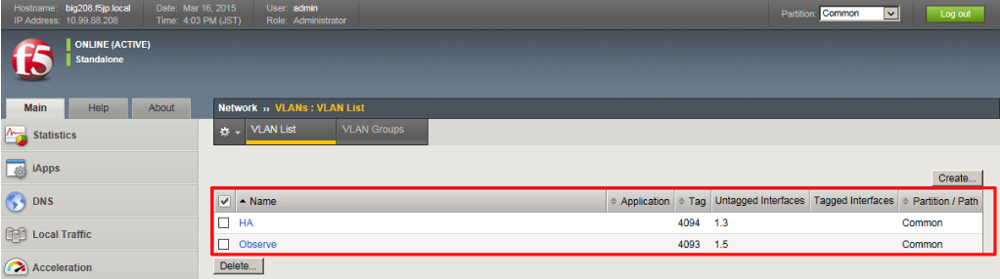

## Self IPの設定
Standby機に設定されたSelf IPアドレスは以下のようになります。
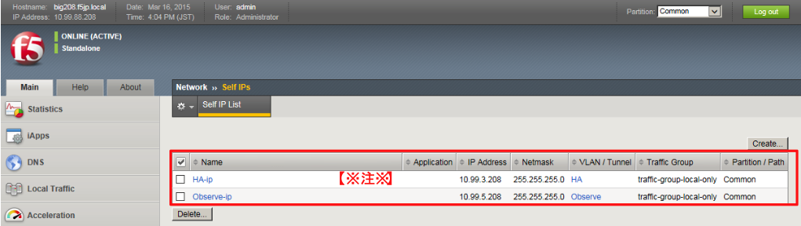

## NTPの設定
NTP設定を行います。
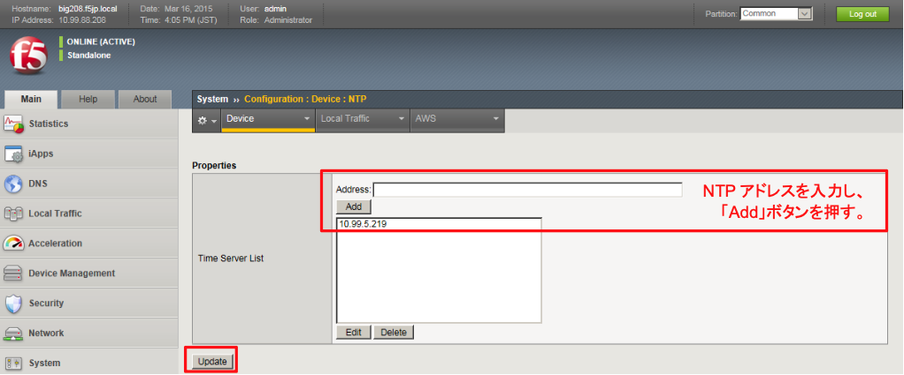

## Device Managementの設定
次に、「Device Management」→「Devices」で、自分自身：bigYYY.f5jp.local(self)を選択し、Active機同様に、 Device Connectivityの設定を行います。

(1) ConfigSync設定
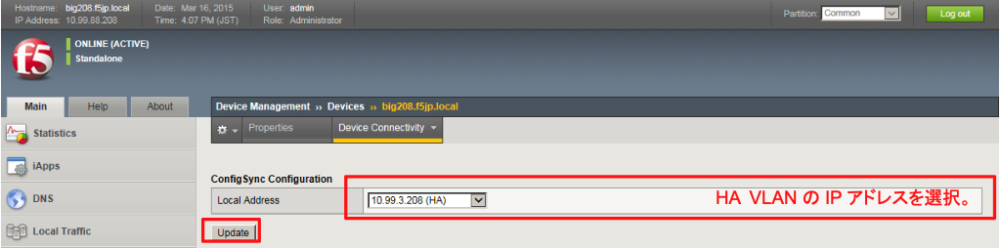

(2) Network Failover設定
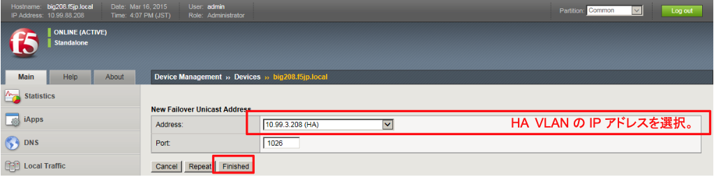

(3) Mirroring設定
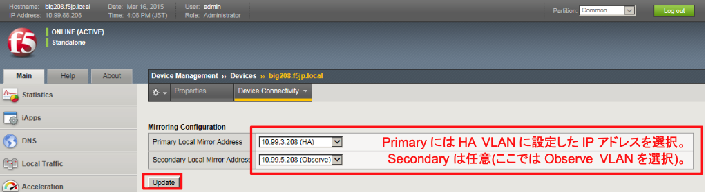

## Route Domain関連の設定 
(1) Active機同様に、RD1-Partitionを作ります。
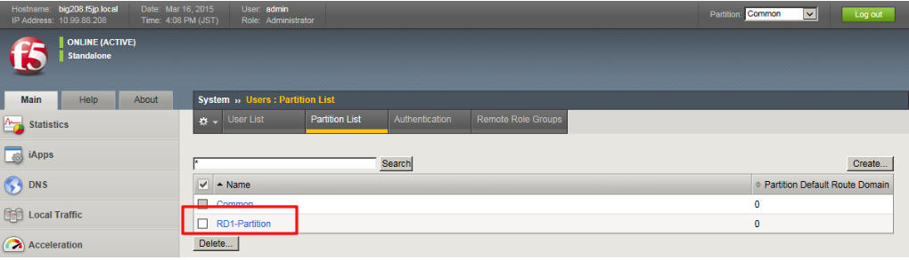

(2) RD1-Partitionに切り替えます。
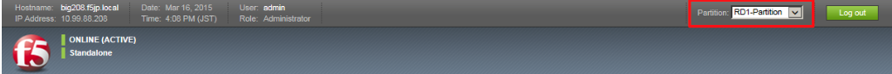

(3) Active機同様にVLANを作ります。
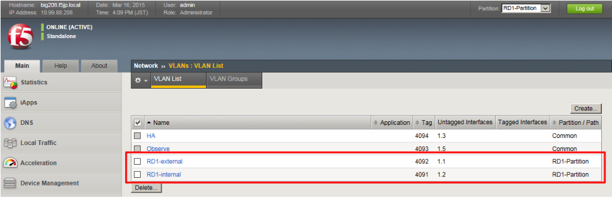

(4) Active機同様にルートドメイン：RD1を作ります。
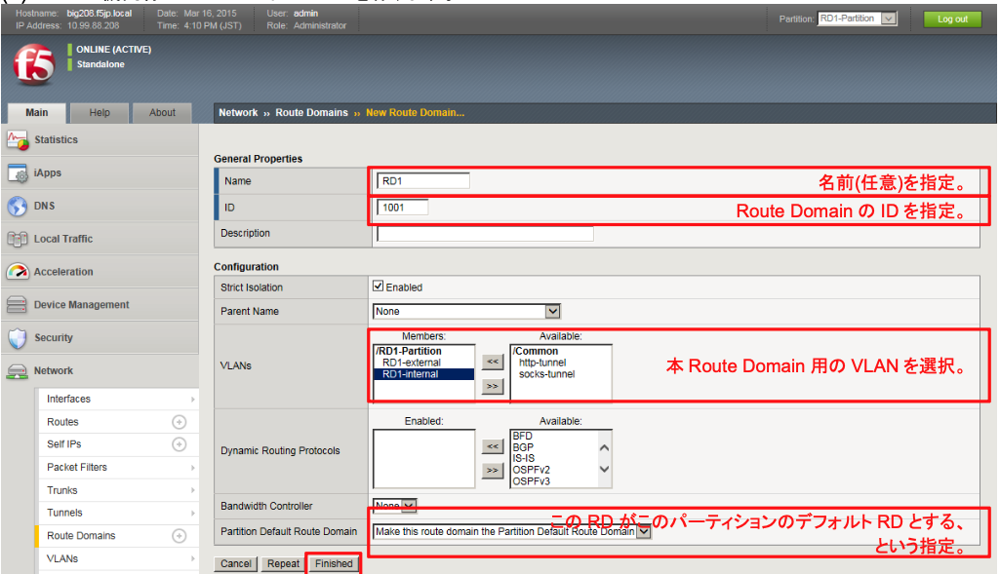

(5) Active機同様にRD1のSelf IPを設定します。
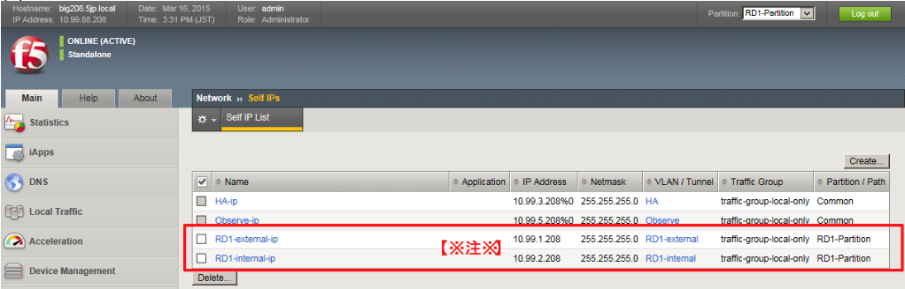
