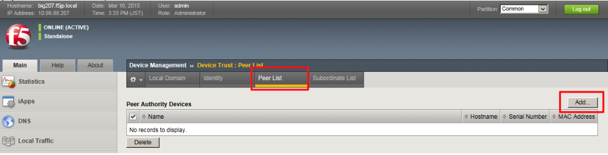
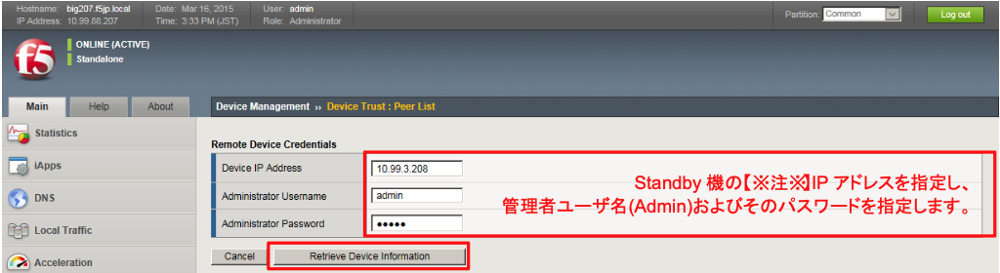
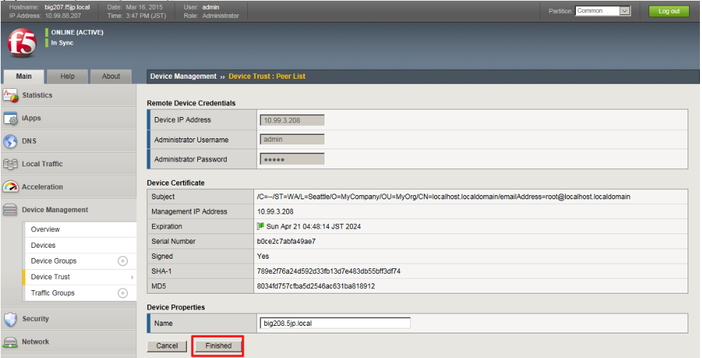
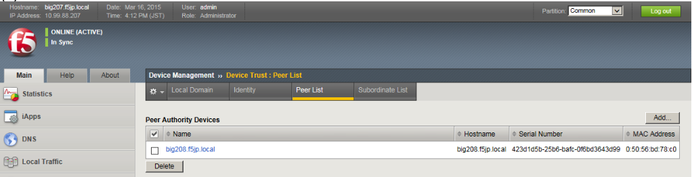
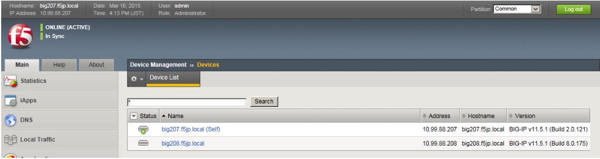

# デバイストラスト設定 (Active機：bigXXX.f5jp.local側から実施)

デバイストラスト設定にて、冗長化する機器間で信頼関係を結びます。

以降は、Active機：bigXXX.f5jp.localからのみ、設定します。

Commonで行います。

(1) 「Device Management」→「Device Trust」→「Peer List」を選択し、「Add」ボタンを押します。

(2) Standby機：bigYYY.f5jp.localのIPアドレスと管理者ID(Admin)とパスワードを指定します。「Retrieve Device Information」ボタンを押します。

(3) Standby機：bigYYY.f5jp.localの証明書情報が表示されます。「Finished」ボタンを押して終了します。

(4) 承認されたデバイスとして登録された状態です。

(5) 「Device Management」→「Devices」で見ると、(self)に加え、Standby機：bigYYY.f5jp.localも表示されます。
(ここは確認のみです。)

