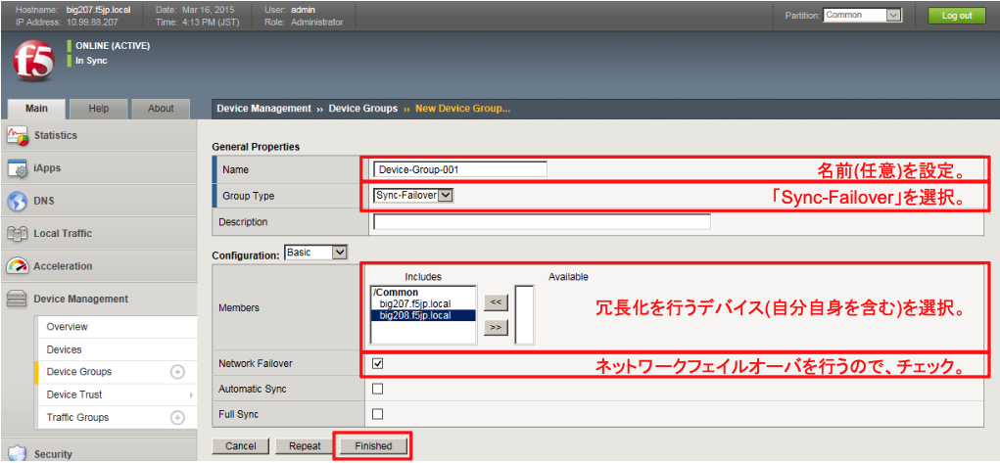
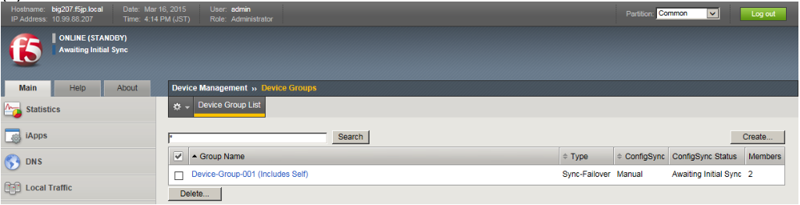

# デバイスグループの設定

デバイスグループは、デバイストラストで信頼関係を結んだ機器の間で、どの機器間で冗長化を行うかの指定です。

デバイストラストはBIG-IP×3台以上で構成することも可能で、例えば、1と2で冗長化を行い、2と3はコンフィグ同期のみ行う、という組合せが可能となっています。この組み合わせをデバイスグループで指定します。

2台で冗長化を行う場合はデバイスグループの組み方をあまり意識する必要はありませんが、設定は必要です。

(1) 「Device Management」→「Device Groups」から、デバイスグループを作成します。

(2) デバイスグループが作られた状態です。
