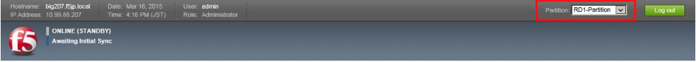
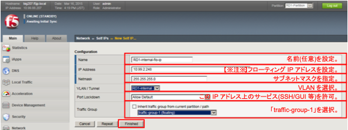
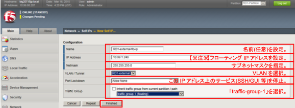
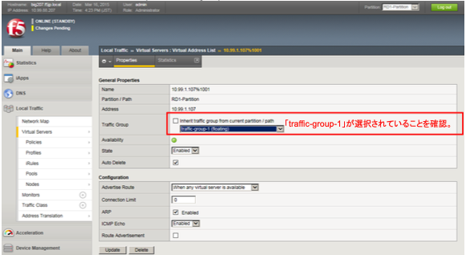
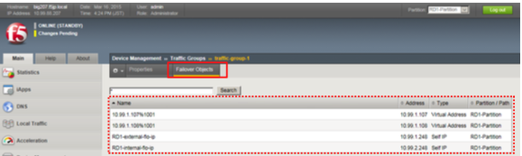

# トラフィックグループの設定

トラフィックグループは、デバイスグループ内で移動するオブジェクトの集合です。

主に、Virtual Serverと共用IP(Floating IP)がトラフィックグループのオブジェクトです。

「Device Management」→「Traffic Groups」を確認します。

(1) デフォルトで、「Traffic-group-1」という名前のトラフィックグループが存在しています。

以降、このTraffic-group-1に対して、Floating IPおよびVirtual Serverを割当てていきます。

(2) RD1-Internal VLAN側の共用IP(Floating IP)を追加設定します。

Floating IPは、Active機ダウン時にStandby機が引き継ぐ、自身に設定されたIPアドレス(Self IP)を指します。

実サーバは、このIPアドレスをデフォルトゲートウェイに指定することで、Active/Standbyの切り替わり発生時にも、 即座に通信を再開できます。

RD1-Partitionに切り替えます。

「Network」→「Self IPs」から設定します。

ここで、Traffic-group-1を選択することで、そのトラフィックグループに属させます。

(3) External VLAN側の共用IP(Floating IP)も追加設定します。

(4) 「Local Traffic」→「Virtual Servers」→「Virtual Address List」を選択します。

このPropertiesのTraffic Groupで、「traffic-group-1」が選択されていることを確認します。

(5) 「Device Management」→「Traffic Groups」のTraffic-group-1をクリック→「Failover Objects」タブをクリックして、中身を確認すると、フェイルオーバーオブジェクトは以下のようになっています。
