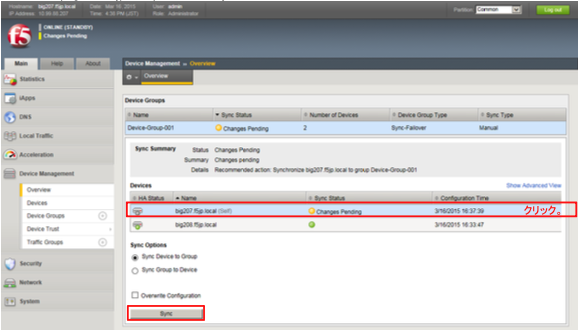
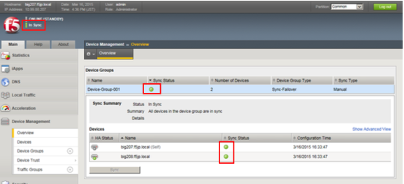

# ConfigSync

Active機：bigXXX.f5jp.localにのみに行った設定を、Standby機：bigYYY.f5jp.localに同期するために、ConfigSync を実行します。

(1) 「Device Management」→「Overview」を選択します。

Active機(BigXXX.f5jp.local)を選択し、「Sync」ボタンを押すことで、コンフィグ同期が行われます。


(2) しばらく待つと、コンフィグ同期が完了し、各ステータスがグリーンになります。


※Syncがうまくいかない場合、以下のコマンドを実行してみてください。

```tmsh
root@(bigXXX)(cfg-sync Awaiting Initial Sync)(Standby)(/Common)(tmos)# modify cm device-group
Device-Group-001 devices modify { bigYYY.f5jp.local { set-sync-leader } }
```

