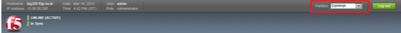
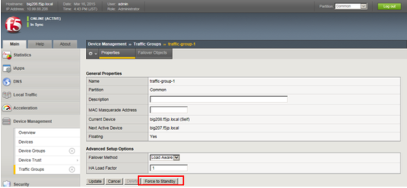
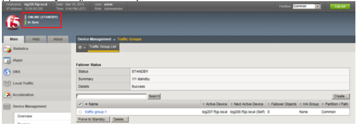
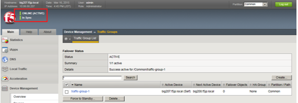

# Traffic-group-1の優先度設定

デフォルトでは、管理IPアドレス設定の大きい値を持つものがTraffic-group-1のActive機になります。

したがって、本構成では、Standbyにしたい機器：bigYYY.f5jp.localがこのTraffic-group-1のActiveとなっています。

以降、Active機にしたい機器：bigXXX.f5jp.localがTraffic-group-1のActiveになるように設定します。

PartitionはCommonで実施します。

(1) bigYYY.f5jp.localへ移動し、「Device Management」→「Traffic Groups」からTraffic-group-1を選択し、「Force to Standby」ボタンを押します。

(2) その結果、bigYYY.f5jp.localがStandbyになります。

(3) bigXXX.f5jp.localはActiveになります。

以上で冗長化設定は完了です。
